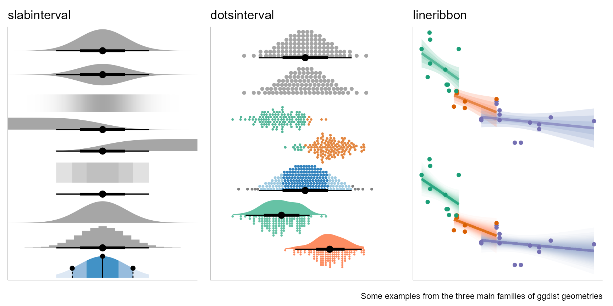

## {}

::: columns
::: {.column width="37.5%"}
:::
::: {.column width="60%"}

::: {.title data-id="title"}
PhD Milestone Presentation

Progress Review
:::

::: {.dateplace}
28th February 2025
:::

Mitchell O'Hara-Wild, Monash University

::: {.smaller}
Supervised by Rob Hyndman and George Athanasopolous
:::

::: {.callout-link}

## Useful links

{.icon} [social.mitchelloharawild.com](https://social.mitchelloharawild.com/)

{.icon} [slides.mitchelloharawild.com/phd-progress-review](https://slides.mitchelloharawild.com/phd-progress-review)

{.icon} [mitchelloharawild/phd-progress-review](https://github.com/mitchelloharawild/phd-progress-review)

:::

:::
:::

{.image-left}


## {.fragment-remove}

::: columns
::: {.column width="40%"}
:::
::: {.column width="60%"}
### PhD thesis structure


::: {.container .fragment .fade-up fragment-index=1}
::: {.timeline .timeline-left style="height: 720px;"}


::: {.timeline-block}
::: {.timeline-icon}

:::
::: {.timeline-content}
**Graph coherency constraints**

::: {.timeline-details .fragment .fade-out fragment-index=2}

Graphs flexibly describe cross-sectional relationships between time series.

:::
::: {.timeline-date}
Topic 1
:::
:::
:::


::: {.timeline-block .fragment .fade-up fragment-index=2}
::: {.timeline-icon}

:::
::: {.timeline-content .fragment .custom .highlight fragment-index=8}
**Pruning data with graphs**
  
::: {.timeline-details .fragment .fade-out fragment-index=4}
Pruning graphs to remove uninformative time series can both improve forecasting accuracy and computation time.
:::
::: {.timeline-date}
Topic 2
:::
:::
:::


::: {.timeline-block .fragment .fade-up fragment-index=4}
::: {.timeline-icon}

:::
::: {.timeline-content}
**Representing probabilistic forecasts**

::: {.timeline-details .fragment .fade-out fragment-index=5}
Vectorised distributions for use in a tidy forecasting workflow to adequately describe forecast uncertainty.

:::
::: {.timeline-date}
Topic 3
:::
:::
:::

::: {.timeline-block .fragment .fade-up fragment-index=5}
::: {.timeline-icon}

:::
::: {.timeline-content}
**Temporal coherency constraints**

::: {.timeline-details .fragment .fade-out fragment-index=6}
Representing time with varied temporal granularities in a tidy time series data structure.
:::
::: {.timeline-date}
Topic 4
:::
:::
:::


::: {.timeline-block .fragment .fade-up fragment-index=6}
::: {.timeline-icon}

:::
::: {.timeline-content}
**Grammar of temporal graphics**

::: {.timeline-details .fragment .fade-out fragment-index=7}
Extends the grammar of graphics to support calendar-based temporal visualisation.
:::
::: {.timeline-date}
Topic 5
:::
:::
:::

::: {.timeline-block .fragment .fade-up fragment-index=7}
::: {.timeline-icon}

:::
::: {.timeline-content}
**Tidy forecasting framework**

::: {.timeline-details .fragment .fade-out fragment-index=8}
Implements the research topics above within a tidy forecasting workflow.
:::
::: {.timeline-date}
Topic 6
:::
:::
:::


:::
:::


:::
:::

{.image-left}


::: {.cell}

:::


## {}

::: columns

::: {.column width="60%"}
### Forecast reconciliation

Reconciliation adjusts forecasts to satisfy coherency constraints.

This process generally improves forecasting accuracy, by sharing info between series.

::: {.fragment .fade-up}
::: {.callout-note}
## Coherent forecasting

Coherent forecasts are produced in three steps:

1. Aggregating coherent data

2. Producing base forecasts

3. Reconciling base forecasts

:::
:::

:::
:::

{.image-right}


## {.fragment-remove}

::: columns

::: {.column width="40%"}
:::
::: {.column width="60%"}

### Aggregating coherent data

Combinations of **cross-sectional dimensions** at specific **temporal granularities** are used to aggregate time series datasets.

This aggregation usually starts from a set of 'bottom' level time series.

::: {.fragment .fade-out fragment-index=1}

For example, Australian tourism:


::: {.cell}

```{.r .cell-code}
library(fpp3)
tourism
```

::: {.cell-output .cell-output-stdout}

```
# A tsibble: 24,320 x 5 [1Q]
# Key:       Region, State, Purpose [304]
   Quarter Region   State           Purpose  Trips
     <qtr> <chr>    <chr>           <chr>    <dbl>
 1 1998 Q1 Adelaide South Australia Business  135.
 2 1998 Q2 Adelaide South Australia Business  110.
 3 1998 Q3 Adelaide South Australia Business  166.
 4 1998 Q4 Adelaide South Australia Business  127.
 5 1999 Q1 Adelaide South Australia Business  137.
 6 1999 Q2 Adelaide South Australia Business  200.
 7 1999 Q3 Adelaide South Australia Business  169.
 8 1999 Q4 Adelaide South Australia Business  134.
 9 2000 Q1 Adelaide South Australia Business  154.
10 2000 Q2 Adelaide South Australia Business  169.
# ℹ 24,310 more rows
```


:::
:::


:::

::: {.fragment .fade-up fragment-index=1}
::: {.callout-note}
## The most disaggregated data

Almost all time series used in coherent forecasting is sourced from databases of **events or transactions**.

These timestamped entries are pre-aggregated into time series over some dimensions at a chosen granularity.
:::
:::

:::
:::

{.image-left}


## {}

### Aggregating coherent data

Related time series can be aggregated in three ways:

<!-- ::: {.sticker-float-right} -->
<!--  -->
<!-- ::: -->

::: columns

::: {.column width="33%"}
::: {.callout-note icon=false}
## 📚 Hierarchical

One path from top to bottom.


::::::{.cell fig-height="3" fig-width="4" layout-align="default"}

:::::{.cell-output-display}

::::{}
`<figure class=''>`{=html}

:::{}
```{=html}
<svg width="384" height="288" viewbox="0.00 0.00 310.00 257.60" xmlns="http://www.w3.org/2000/svg" xlink="http://www.w3.org/1999/xlink" style="; max-width: none; max-height: none; display: block; margin: auto auto auto auto">
<g id="graph0" class="graph" transform="scale(1 1) rotate(0) translate(4 253.6)">
<title>G</title>
<polygon fill="white" stroke="transparent" points="-4,4 -4,-253.6 306,-253.6 306,4 -4,4"></polygon>
<g id="clust1" class="cluster">
<title>cluster_1</title>
<polygon fill="none" stroke="#999999" stroke-dasharray="5,2" points="8,-8 8,-84.8 294,-84.8 294,-8 8,-8"></polygon>
<text text-anchor="middle" x="151" y="-68.2" font-family="Times,serif" font-size="14.00">Bottom</text>
</g>
<g id="clust2" class="cluster">
<title>cluster_0</title>
<polygon fill="none" stroke="#999999" stroke-dasharray="5,2" points="80,-92.8 80,-241.6 222,-241.6 222,-92.8 80,-92.8"></polygon>
<text text-anchor="middle" x="151" y="-225" font-family="Times,serif" font-size="14.00">Upper</text>
</g>
<!-- AX -->
<g id="node1" class="node">
<title>AX</title>
<ellipse fill="none" stroke="black" cx="259" cy="-34" rx="27" ry="18"></ellipse>
<text text-anchor="middle" x="259" y="-29.8" font-family="Times,serif" font-size="14.00">AX</text>
</g>
<!-- AY -->
<g id="node2" class="node">
<title>AY</title>
<ellipse fill="none" stroke="black" cx="187" cy="-34" rx="27" ry="18"></ellipse>
<text text-anchor="middle" x="187" y="-29.8" font-family="Times,serif" font-size="14.00">AY</text>
</g>
<!-- BX -->
<g id="node3" class="node">
<title>BX</title>
<ellipse fill="none" stroke="black" cx="115" cy="-34" rx="27" ry="18"></ellipse>
<text text-anchor="middle" x="115" y="-29.8" font-family="Times,serif" font-size="14.00">BX</text>
</g>
<!-- BY -->
<g id="node4" class="node">
<title>BY</title>
<ellipse fill="none" stroke="black" cx="43" cy="-34" rx="27" ry="18"></ellipse>
<text text-anchor="middle" x="43" y="-29.8" font-family="Times,serif" font-size="14.00">BY</text>
</g>
<!-- Total -->
<g id="node5" class="node">
<title>Total</title>
<ellipse fill="none" stroke="black" cx="151" cy="-190.8" rx="31.33" ry="18"></ellipse>
<text text-anchor="middle" x="151" y="-186.6" font-family="Times,serif" font-size="14.00">Total</text>
</g>
<!-- A -->
<g id="node6" class="node">
<title>A</title>
<ellipse fill="none" stroke="black" cx="187" cy="-118.8" rx="27" ry="18"></ellipse>
<text text-anchor="middle" x="187" y="-114.6" font-family="Times,serif" font-size="14.00">A</text>
</g>
<!-- Total&#45;&gt;A -->
<g id="edge1" class="edge">
<title>Total-&gt;A</title>
<path fill="none" stroke="black" d="M159.53,-173.21C163.84,-164.84 169.15,-154.51 173.95,-145.17"></path>
<polygon fill="black" stroke="black" points="177.07,-146.76 178.53,-136.27 170.84,-143.56 177.07,-146.76"></polygon>
</g>
<!-- B -->
<g id="node7" class="node">
<title>B</title>
<ellipse fill="none" stroke="black" cx="115" cy="-118.8" rx="27" ry="18"></ellipse>
<text text-anchor="middle" x="115" y="-114.6" font-family="Times,serif" font-size="14.00">B</text>
</g>
<!-- Total&#45;&gt;B -->
<g id="edge2" class="edge">
<title>Total-&gt;B</title>
<path fill="none" stroke="black" d="M142.47,-173.21C138.16,-164.84 132.85,-154.51 128.05,-145.17"></path>
<polygon fill="black" stroke="black" points="131.16,-143.56 123.47,-136.27 124.93,-146.76 131.16,-143.56"></polygon>
</g>
<!-- A&#45;&gt;AX -->
<g id="edge3" class="edge">
<title>A-&gt;AX</title>
<path fill="none" stroke="black" d="M200.21,-102.61C211.07,-90.12 226.63,-72.23 239.01,-57.99"></path>
<polygon fill="black" stroke="black" points="241.96,-59.93 245.88,-50.09 236.67,-55.34 241.96,-59.93"></polygon>
</g>
<!-- A&#45;&gt;AY -->
<g id="edge4" class="edge">
<title>A-&gt;AY</title>
<path fill="none" stroke="black" d="M187,-100.64C187,-89.54 187,-74.85 187,-62.18"></path>
<polygon fill="black" stroke="black" points="190.5,-62.13 187,-52.13 183.5,-62.13 190.5,-62.13"></polygon>
</g>
<!-- B&#45;&gt;BX -->
<g id="edge5" class="edge">
<title>B-&gt;BX</title>
<path fill="none" stroke="black" d="M115,-100.64C115,-89.54 115,-74.85 115,-62.18"></path>
<polygon fill="black" stroke="black" points="118.5,-62.13 115,-52.13 111.5,-62.13 118.5,-62.13"></polygon>
</g>
<!-- B&#45;&gt;BY -->
<g id="edge6" class="edge">
<title>B-&gt;BY</title>
<path fill="none" stroke="black" d="M101.79,-102.61C90.93,-90.12 75.37,-72.23 62.99,-57.99"></path>
<polygon fill="black" stroke="black" points="65.33,-55.34 56.12,-50.09 60.04,-59.93 65.33,-55.34"></polygon>
</g>
</g>
</svg>
```
:::
`</figure>`{=html}
::::
:::::
::::::


:::
:::

::: {.column width="33%"}
::: {.callout-note icon=false}
## 📚 Grouped

Many paths from top to bottom.


::::::{.cell fig-height="3" fig-width="4" layout-align="default"}

:::::{.cell-output-display}

::::{}
`<figure class=''>`{=html}

:::{}
```{=html}
<svg width="384" height="288" viewbox="0.00 0.00 316.00 270.40" xmlns="http://www.w3.org/2000/svg" xlink="http://www.w3.org/1999/xlink" style="; max-width: none; max-height: none; display: block; margin: auto auto auto auto">
<g id="graph0" class="graph" transform="scale(1 1) rotate(0) translate(4 266.4)">
<title>G</title>
<polygon fill="white" stroke="transparent" points="-4,4 -4,-266.4 312,-266.4 312,4 -4,4"></polygon>
<g id="clust2" class="cluster">
<title>cluster_1</title>
<polygon fill="none" stroke="#999999" stroke-dasharray="5,2" points="115,-177.6 115,-254.4 193,-254.4 193,-177.6 115,-177.6"></polygon>
<text text-anchor="middle" x="154" y="-237.8" font-family="Times,serif" font-size="14.00">Top</text>
</g>
<g id="clust1" class="cluster">
<title>cluster_0</title>
<polygon fill="none" stroke="#999999" stroke-dasharray="5,2" points="11,-8 11,-84.8 297,-84.8 297,-8 11,-8"></polygon>
<text text-anchor="middle" x="154" y="-68.2" font-family="Times,serif" font-size="14.00">Bottom</text>
</g>
<g id="clust3" class="cluster">
<title>cluster_2</title>
<polygon fill="none" stroke="#999999" stroke-dasharray="5,2" points="8,-92.8 8,-169.6 150,-169.6 150,-92.8 8,-92.8"></polygon>
<text text-anchor="middle" x="79" y="-153" font-family="Times,serif" font-size="14.00">Path AB</text>
</g>
<g id="clust4" class="cluster">
<title>cluster_3</title>
<polygon fill="none" stroke="#999999" stroke-dasharray="5,2" points="158,-92.8 158,-169.6 300,-169.6 300,-92.8 158,-92.8"></polygon>
<text text-anchor="middle" x="229" y="-153" font-family="Times,serif" font-size="14.00">Path XY</text>
</g>
<!-- BY -->
<g id="node1" class="node">
<title>BY</title>
<ellipse fill="none" stroke="black" cx="262" cy="-34" rx="27" ry="18"></ellipse>
<text text-anchor="middle" x="262" y="-29.8" font-family="Times,serif" font-size="14.00">BY</text>
</g>
<!-- BX -->
<g id="node2" class="node">
<title>BX</title>
<ellipse fill="none" stroke="black" cx="190" cy="-34" rx="27" ry="18"></ellipse>
<text text-anchor="middle" x="190" y="-29.8" font-family="Times,serif" font-size="14.00">BX</text>
</g>
<!-- AY -->
<g id="node3" class="node">
<title>AY</title>
<ellipse fill="none" stroke="black" cx="118" cy="-34" rx="27" ry="18"></ellipse>
<text text-anchor="middle" x="118" y="-29.8" font-family="Times,serif" font-size="14.00">AY</text>
</g>
<!-- AX -->
<g id="node4" class="node">
<title>AX</title>
<ellipse fill="none" stroke="black" cx="46" cy="-34" rx="27" ry="18"></ellipse>
<text text-anchor="middle" x="46" y="-29.8" font-family="Times,serif" font-size="14.00">AX</text>
</g>
<!-- Total -->
<g id="node5" class="node">
<title>Total</title>
<ellipse fill="none" stroke="black" cx="154" cy="-203.6" rx="31.33" ry="18"></ellipse>
<text text-anchor="middle" x="154" y="-199.4" font-family="Times,serif" font-size="14.00">Total</text>
</g>
<!-- A -->
<g id="node6" class="node">
<title>A</title>
<ellipse fill="none" stroke="black" cx="43" cy="-118.8" rx="27" ry="18"></ellipse>
<text text-anchor="middle" x="43" y="-114.6" font-family="Times,serif" font-size="14.00">A</text>
</g>
<!-- Total&#45;&gt;A -->
<g id="edge7" class="edge">
<title>Total-&gt;A</title>
<path fill="none" stroke="black" d="M135.67,-188.93C117.35,-175.26 89.03,-154.14 68.52,-138.84"></path>
<polygon fill="black" stroke="black" points="70.37,-135.85 60.26,-132.68 66.18,-141.46 70.37,-135.85"></polygon>
</g>
<!-- B -->
<g id="node7" class="node">
<title>B</title>
<ellipse fill="none" stroke="black" cx="115" cy="-118.8" rx="27" ry="18"></ellipse>
<text text-anchor="middle" x="115" y="-114.6" font-family="Times,serif" font-size="14.00">B</text>
</g>
<!-- Total&#45;&gt;B -->
<g id="edge8" class="edge">
<title>Total-&gt;B</title>
<path fill="none" stroke="black" d="M146.11,-185.84C140.63,-174.21 133.22,-158.49 127.01,-145.31"></path>
<polygon fill="black" stroke="black" points="130.17,-143.8 122.75,-136.25 123.84,-146.79 130.17,-143.8"></polygon>
</g>
<!-- X -->
<g id="node8" class="node">
<title>X</title>
<ellipse fill="none" stroke="black" cx="193" cy="-118.8" rx="27" ry="18"></ellipse>
<text text-anchor="middle" x="193" y="-114.6" font-family="Times,serif" font-size="14.00">X</text>
</g>
<!-- Total&#45;&gt;X -->
<g id="edge1" class="edge">
<title>Total-&gt;X</title>
<path fill="none" stroke="black" stroke-dasharray="5,2" d="M161.89,-185.84C167.37,-174.21 174.78,-158.49 180.99,-145.31"></path>
<polygon fill="black" stroke="black" points="184.16,-146.79 185.25,-136.25 177.83,-143.8 184.16,-146.79"></polygon>
</g>
<!-- Y -->
<g id="node9" class="node">
<title>Y</title>
<ellipse fill="none" stroke="black" cx="265" cy="-118.8" rx="27" ry="18"></ellipse>
<text text-anchor="middle" x="265" y="-114.6" font-family="Times,serif" font-size="14.00">Y</text>
</g>
<!-- Total&#45;&gt;Y -->
<g id="edge2" class="edge">
<title>Total-&gt;Y</title>
<path fill="none" stroke="black" stroke-dasharray="5,2" d="M172.33,-188.93C190.65,-175.26 218.97,-154.14 239.48,-138.84"></path>
<polygon fill="black" stroke="black" points="241.82,-141.46 247.74,-132.68 237.63,-135.85 241.82,-141.46"></polygon>
</g>
<!-- A&#45;&gt;AY -->
<g id="edge10" class="edge">
<title>A-&gt;AY</title>
<path fill="none" stroke="black" d="M56.41,-103C67.93,-90.28 84.7,-71.76 97.84,-57.26"></path>
<polygon fill="black" stroke="black" points="100.59,-59.44 104.71,-49.67 95.4,-54.74 100.59,-59.44"></polygon>
</g>
<!-- A&#45;&gt;AX -->
<g id="edge9" class="edge">
<title>A-&gt;AX</title>
<path fill="none" stroke="black" d="M43.62,-100.64C44.02,-89.54 44.56,-74.85 45.02,-62.18"></path>
<polygon fill="black" stroke="black" points="48.51,-62.25 45.38,-52.13 41.52,-62 48.51,-62.25"></polygon>
</g>
<!-- B&#45;&gt;BY -->
<g id="edge12" class="edge">
<title>B-&gt;BY</title>
<path fill="none" stroke="black" d="M135.13,-106.46C160.53,-92.15 204.38,-67.45 233.29,-51.17"></path>
<polygon fill="black" stroke="black" points="235.12,-54.16 242.11,-46.2 231.68,-48.06 235.12,-54.16"></polygon>
</g>
<!-- B&#45;&gt;BX -->
<g id="edge11" class="edge">
<title>B-&gt;BX</title>
<path fill="none" stroke="black" d="M128.41,-103C139.93,-90.28 156.7,-71.76 169.84,-57.26"></path>
<polygon fill="black" stroke="black" points="172.59,-59.44 176.71,-49.67 167.4,-54.74 172.59,-59.44"></polygon>
</g>
<!-- X&#45;&gt;BX -->
<g id="edge4" class="edge">
<title>X-&gt;BX</title>
<path fill="none" stroke="black" stroke-dasharray="5,2" d="M192.38,-100.64C191.98,-89.54 191.44,-74.85 190.98,-62.18"></path>
<polygon fill="black" stroke="black" points="194.48,-62 190.62,-52.13 187.49,-62.25 194.48,-62"></polygon>
</g>
<!-- X&#45;&gt;AX -->
<g id="edge3" class="edge">
<title>X-&gt;AX</title>
<path fill="none" stroke="black" stroke-dasharray="5,2" d="M172.87,-106.46C147.47,-92.15 103.62,-67.45 74.71,-51.17"></path>
<polygon fill="black" stroke="black" points="76.32,-48.06 65.89,-46.2 72.88,-54.16 76.32,-48.06"></polygon>
</g>
<!-- Y&#45;&gt;BY -->
<g id="edge6" class="edge">
<title>Y-&gt;BY</title>
<path fill="none" stroke="black" stroke-dasharray="5,2" d="M264.38,-100.64C263.98,-89.54 263.44,-74.85 262.98,-62.18"></path>
<polygon fill="black" stroke="black" points="266.48,-62 262.62,-52.13 259.49,-62.25 266.48,-62"></polygon>
</g>
<!-- Y&#45;&gt;AY -->
<g id="edge5" class="edge">
<title>Y-&gt;AY</title>
<path fill="none" stroke="black" stroke-dasharray="5,2" d="M244.87,-106.46C219.47,-92.15 175.62,-67.45 146.71,-51.17"></path>
<polygon fill="black" stroke="black" points="148.32,-48.06 137.89,-46.2 144.88,-54.16 148.32,-48.06"></polygon>
</g>
</g>
</svg>
```
:::
`</figure>`{=html}
::::
:::::
::::::


:::
:::
::: {.column width="33%"}
::: {.callout-note icon=false}
## 💡 Graph (topic 1)

Many paths from (many) top to (many) bottom series.


::::::{.cell fig-height="3" fig-width="4" layout-align="default"}

:::::{.cell-output-display}

::::{}
`<figure class=''>`{=html}

:::{}
```{=html}
<svg width="384" height="288" viewbox="0.00 0.00 604.00 257.60" xmlns="http://www.w3.org/2000/svg" xlink="http://www.w3.org/1999/xlink" style="; max-width: none; max-height: none; display: block; margin: auto auto auto auto">
<g id="graph0" class="graph" transform="scale(1 1) rotate(0) translate(4 253.6)">
<title>G</title>
<polygon fill="white" stroke="transparent" points="-4,4 -4,-253.6 600,-253.6 600,4 -4,4"></polygon>
<g id="clust1" class="cluster">
<title>cluster_1</title>
<polygon fill="none" stroke="#999999" stroke-dasharray="5,2" points="8,-8 8,-84.8 222,-84.8 222,-8 8,-8"></polygon>
<text text-anchor="middle" x="115" y="-68.2" font-family="Times,serif" font-size="14.00">Unconstrained XY</text>
</g>
<g id="clust2" class="cluster">
<title>cluster_2</title>
<polygon fill="none" stroke="#999999" stroke-dasharray="5,2" points="230,-8 230,-84.8 588,-84.8 588,-8 230,-8"></polygon>
<text text-anchor="middle" x="409" y="-68.2" font-family="Times,serif" font-size="14.00">Unconstrained AB</text>
</g>
<g id="clust3" class="cluster">
<title>cluster_0</title>
<polygon fill="none" stroke="#999999" stroke-dasharray="5,2" points="194,-92.8 194,-241.6 408,-241.6 408,-92.8 194,-92.8"></polygon>
<text text-anchor="middle" x="301" y="-225" font-family="Times,serif" font-size="14.00">Constrained</text>
</g>
<!-- X2 -->
<g id="node1" class="node">
<title>X2</title>
<ellipse fill="none" stroke="black" cx="187" cy="-34" rx="27" ry="18"></ellipse>
<text text-anchor="middle" x="187" y="-29.8" font-family="Times,serif" font-size="14.00">X2</text>
</g>
<!-- X1 -->
<g id="node2" class="node">
<title>X1</title>
<ellipse fill="none" stroke="black" cx="115" cy="-34" rx="27" ry="18"></ellipse>
<text text-anchor="middle" x="115" y="-29.8" font-family="Times,serif" font-size="14.00">X1</text>
</g>
<!-- Y -->
<g id="node3" class="node">
<title>Y</title>
<ellipse fill="none" stroke="black" cx="43" cy="-34" rx="27" ry="18"></ellipse>
<text text-anchor="middle" x="43" y="-29.8" font-family="Times,serif" font-size="14.00">Y</text>
</g>
<!-- B2 -->
<g id="node4" class="node">
<title>B2</title>
<ellipse fill="none" stroke="black" cx="553" cy="-34" rx="27" ry="18"></ellipse>
<text text-anchor="middle" x="553" y="-29.8" font-family="Times,serif" font-size="14.00">B2</text>
</g>
<!-- B1 -->
<g id="node5" class="node">
<title>B1</title>
<ellipse fill="none" stroke="black" cx="481" cy="-34" rx="27" ry="18"></ellipse>
<text text-anchor="middle" x="481" y="-29.8" font-family="Times,serif" font-size="14.00">B1</text>
</g>
<!-- A3 -->
<g id="node6" class="node">
<title>A3</title>
<ellipse fill="none" stroke="black" cx="409" cy="-34" rx="27" ry="18"></ellipse>
<text text-anchor="middle" x="409" y="-29.8" font-family="Times,serif" font-size="14.00">A3</text>
</g>
<!-- A2 -->
<g id="node7" class="node">
<title>A2</title>
<ellipse fill="none" stroke="black" cx="337" cy="-34" rx="27" ry="18"></ellipse>
<text text-anchor="middle" x="337" y="-29.8" font-family="Times,serif" font-size="14.00">A2</text>
</g>
<!-- A1 -->
<g id="node8" class="node">
<title>A1</title>
<ellipse fill="none" stroke="black" cx="265" cy="-34" rx="27" ry="18"></ellipse>
<text text-anchor="middle" x="265" y="-29.8" font-family="Times,serif" font-size="14.00">A1</text>
</g>
<!-- Total -->
<g id="node9" class="node">
<title>Total</title>
<ellipse fill="none" stroke="black" cx="267" cy="-190.8" rx="31.33" ry="18"></ellipse>
<text text-anchor="middle" x="267" y="-186.6" font-family="Times,serif" font-size="14.00">Total</text>
</g>
<!-- Total&#45;&gt;Y -->
<g id="edge9" class="edge">
<title>Total-&gt;Y</title>
<path fill="none" stroke="black" stroke-dasharray="5,2" d="M246.73,-176.61C206.26,-148.28 115.45,-84.71 69.99,-52.9"></path>
<polygon fill="black" stroke="black" points="72,-50.03 61.8,-47.16 67.98,-55.76 72,-50.03"></polygon>
</g>
<!-- X -->
<g id="node10" class="node">
<title>X</title>
<ellipse fill="none" stroke="black" cx="229" cy="-118.8" rx="27" ry="18"></ellipse>
<text text-anchor="middle" x="229" y="-114.6" font-family="Times,serif" font-size="14.00">X</text>
</g>
<!-- Total&#45;&gt;X -->
<g id="edge8" class="edge">
<title>Total-&gt;X</title>
<path fill="none" stroke="black" stroke-dasharray="5,2" d="M257.99,-173.21C253.45,-164.84 247.84,-154.51 242.77,-145.17"></path>
<polygon fill="black" stroke="black" points="245.79,-143.39 237.94,-136.27 239.64,-146.73 245.79,-143.39"></polygon>
</g>
<!-- A -->
<g id="node11" class="node">
<title>A</title>
<ellipse fill="none" stroke="black" cx="301" cy="-118.8" rx="27" ry="18"></ellipse>
<text text-anchor="middle" x="301" y="-114.6" font-family="Times,serif" font-size="14.00">A</text>
</g>
<!-- Total&#45;&gt;A -->
<g id="edge1" class="edge">
<title>Total-&gt;A</title>
<path fill="none" stroke="black" d="M275.06,-173.21C279.08,-164.93 284.04,-154.72 288.54,-145.46"></path>
<polygon fill="black" stroke="black" points="291.78,-146.79 293,-136.27 285.48,-143.74 291.78,-146.79"></polygon>
</g>
<!-- B -->
<g id="node12" class="node">
<title>B</title>
<ellipse fill="none" stroke="black" cx="373" cy="-118.8" rx="27" ry="18"></ellipse>
<text text-anchor="middle" x="373" y="-114.6" font-family="Times,serif" font-size="14.00">B</text>
</g>
<!-- Total&#45;&gt;B -->
<g id="edge2" class="edge">
<title>Total-&gt;B</title>
<path fill="none" stroke="black" d="M286.94,-176.63C303.64,-165.61 327.63,-149.76 346.04,-137.61"></path>
<polygon fill="black" stroke="black" points="348.15,-140.4 354.57,-131.97 344.3,-134.56 348.15,-140.4"></polygon>
</g>
<!-- X&#45;&gt;X2 -->
<g id="edge11" class="edge">
<title>X-&gt;X2</title>
<path fill="none" stroke="black" stroke-dasharray="5,2" d="M220.7,-101.44C214.78,-89.76 206.69,-73.82 199.92,-60.48"></path>
<polygon fill="black" stroke="black" points="202.93,-58.66 195.28,-51.32 196.68,-61.83 202.93,-58.66"></polygon>
</g>
<!-- X&#45;&gt;X1 -->
<g id="edge10" class="edge">
<title>X-&gt;X1</title>
<path fill="none" stroke="black" stroke-dasharray="5,2" d="M211.19,-104.86C192.36,-91.19 162.49,-69.49 141.03,-53.9"></path>
<polygon fill="black" stroke="black" points="142.84,-50.89 132.69,-47.85 138.72,-56.56 142.84,-50.89"></polygon>
</g>
<!-- A&#45;&gt;A3 -->
<g id="edge5" class="edge">
<title>A-&gt;A3</title>
<path fill="none" stroke="black" d="M318.35,-104.5C335.99,-90.98 363.49,-69.89 383.59,-54.48"></path>
<polygon fill="black" stroke="black" points="385.88,-57.13 391.69,-48.27 381.63,-51.58 385.88,-57.13"></polygon>
</g>
<!-- A&#45;&gt;A2 -->
<g id="edge4" class="edge">
<title>A-&gt;A2</title>
<path fill="none" stroke="black" d="M308.29,-101.04C313.3,-89.52 320.05,-73.99 325.74,-60.89"></path>
<polygon fill="black" stroke="black" points="329.07,-62.01 329.85,-51.45 322.65,-59.22 329.07,-62.01"></polygon>
</g>
<!-- A&#45;&gt;A1 -->
<g id="edge3" class="edge">
<title>A-&gt;A1</title>
<path fill="none" stroke="black" d="M293.71,-101.04C288.7,-89.52 281.95,-73.99 276.26,-60.89"></path>
<polygon fill="black" stroke="black" points="279.35,-59.22 272.15,-51.45 272.93,-62.01 279.35,-59.22"></polygon>
</g>
<!-- B&#45;&gt;B2 -->
<g id="edge7" class="edge">
<title>B-&gt;B2</title>
<path fill="none" stroke="black" d="M394.71,-107.81C426.56,-93.16 486.07,-65.79 522.36,-49.1"></path>
<polygon fill="black" stroke="black" points="523.87,-52.25 531.49,-44.89 520.94,-45.89 523.87,-52.25"></polygon>
</g>
<!-- B&#45;&gt;B1 -->
<g id="edge6" class="edge">
<title>B-&gt;B1</title>
<path fill="none" stroke="black" d="M390.35,-104.5C407.99,-90.98 435.49,-69.89 455.59,-54.48"></path>
<polygon fill="black" stroke="black" points="457.88,-57.13 463.69,-48.27 453.63,-51.58 457.88,-57.13"></polygon>
</g>
</g>
</svg>
```
:::
`</figure>`{=html}
::::
:::::
::::::


:::
:::

:::


## {}

### Aggregating coherent data

The total time series in a coherent dataset varies by aggregation method.

::: columns

::: {.column width="33%"}
::: {.callout-note icon=false}
## 📚 Hierarchical

$$\sum_{k=1}^{n} \left( \prod_{i = 1}^k l_i \right)$$

where,

* $n$ is the number dimensions,
* $l_i$ is the average number of levels in dimension $i$.


:::
:::

::: {.column width="33%"}
::: {.callout-note icon=false}
## 📚 Grouped

$$\sum_{k=1}^{n} \left( \sum_{\substack{S \subseteq \{1, \dots, n\}, \\ |S| = k}} \left( \prod_{i \in S} l_i \right) \right)$$


where,

* $n$ is the number dimensions,
* $l_i$ is the number of levels in dimension $i$.

:::
:::
::: {.column width="33%"}
::: {.callout-note icon=false}
## 💡 Graph (topic 1)

$$
N_i = 1 + \sum_{j\in C(i)} N_j
$$

where,

* $C(i) = \{ j \in V \mid (i, j) \in E \}$  is the children of node $i$.
:::
:::

:::

## {.fragment-remove}

### Aggregating coherent data

The dimensionality increases exponentially with each additional dimension.

::: {.fragment .fade-out fragment-index=1}


::: {.cell}
::: {.cell-output-display}


```{=html}
<div id="dnjmgyhggm" style="padding-left:0px;padding-right:0px;padding-top:10px;padding-bottom:10px;overflow-x:auto;overflow-y:auto;width:auto;height:auto;">
<style>#dnjmgyhggm table {
  font-family: system-ui, 'Segoe UI', Roboto, Helvetica, Arial, sans-serif, 'Apple Color Emoji', 'Segoe UI Emoji', 'Segoe UI Symbol', 'Noto Color Emoji';
  -webkit-font-smoothing: antialiased;
  -moz-osx-font-smoothing: grayscale;
}

#dnjmgyhggm thead, #dnjmgyhggm tbody, #dnjmgyhggm tfoot, #dnjmgyhggm tr, #dnjmgyhggm td, #dnjmgyhggm th {
  border-style: none;
}

#dnjmgyhggm p {
  margin: 0;
  padding: 0;
}

#dnjmgyhggm .gt_table {
  display: table;
  border-collapse: collapse;
  line-height: normal;
  margin-left: auto;
  margin-right: auto;
  color: #333333;
  font-size: 16px;
  font-weight: normal;
  font-style: normal;
  background-color: #FFFFFF;
  width: auto;
  border-top-style: solid;
  border-top-width: 2px;
  border-top-color: #A8A8A8;
  border-right-style: none;
  border-right-width: 2px;
  border-right-color: #D3D3D3;
  border-bottom-style: solid;
  border-bottom-width: 2px;
  border-bottom-color: #A8A8A8;
  border-left-style: none;
  border-left-width: 2px;
  border-left-color: #D3D3D3;
}

#dnjmgyhggm .gt_caption {
  padding-top: 4px;
  padding-bottom: 4px;
}

#dnjmgyhggm .gt_title {
  color: #333333;
  font-size: 125%;
  font-weight: initial;
  padding-top: 4px;
  padding-bottom: 4px;
  padding-left: 5px;
  padding-right: 5px;
  border-bottom-color: #FFFFFF;
  border-bottom-width: 0;
}

#dnjmgyhggm .gt_subtitle {
  color: #333333;
  font-size: 85%;
  font-weight: initial;
  padding-top: 3px;
  padding-bottom: 5px;
  padding-left: 5px;
  padding-right: 5px;
  border-top-color: #FFFFFF;
  border-top-width: 0;
}

#dnjmgyhggm .gt_heading {
  background-color: #FFFFFF;
  text-align: center;
  border-bottom-color: #FFFFFF;
  border-left-style: none;
  border-left-width: 1px;
  border-left-color: #D3D3D3;
  border-right-style: none;
  border-right-width: 1px;
  border-right-color: #D3D3D3;
}

#dnjmgyhggm .gt_bottom_border {
  border-bottom-style: solid;
  border-bottom-width: 2px;
  border-bottom-color: #D3D3D3;
}

#dnjmgyhggm .gt_col_headings {
  border-top-style: solid;
  border-top-width: 2px;
  border-top-color: #D3D3D3;
  border-bottom-style: solid;
  border-bottom-width: 2px;
  border-bottom-color: #D3D3D3;
  border-left-style: none;
  border-left-width: 1px;
  border-left-color: #D3D3D3;
  border-right-style: none;
  border-right-width: 1px;
  border-right-color: #D3D3D3;
}

#dnjmgyhggm .gt_col_heading {
  color: #333333;
  background-color: #FFFFFF;
  font-size: 100%;
  font-weight: normal;
  text-transform: inherit;
  border-left-style: none;
  border-left-width: 1px;
  border-left-color: #D3D3D3;
  border-right-style: none;
  border-right-width: 1px;
  border-right-color: #D3D3D3;
  vertical-align: bottom;
  padding-top: 5px;
  padding-bottom: 6px;
  padding-left: 5px;
  padding-right: 5px;
  overflow-x: hidden;
}

#dnjmgyhggm .gt_column_spanner_outer {
  color: #333333;
  background-color: #FFFFFF;
  font-size: 100%;
  font-weight: normal;
  text-transform: inherit;
  padding-top: 0;
  padding-bottom: 0;
  padding-left: 4px;
  padding-right: 4px;
}

#dnjmgyhggm .gt_column_spanner_outer:first-child {
  padding-left: 0;
}

#dnjmgyhggm .gt_column_spanner_outer:last-child {
  padding-right: 0;
}

#dnjmgyhggm .gt_column_spanner {
  border-bottom-style: solid;
  border-bottom-width: 2px;
  border-bottom-color: #D3D3D3;
  vertical-align: bottom;
  padding-top: 5px;
  padding-bottom: 5px;
  overflow-x: hidden;
  display: inline-block;
  width: 100%;
}

#dnjmgyhggm .gt_spanner_row {
  border-bottom-style: hidden;
}

#dnjmgyhggm .gt_group_heading {
  padding-top: 8px;
  padding-bottom: 8px;
  padding-left: 5px;
  padding-right: 5px;
  color: #333333;
  background-color: #FFFFFF;
  font-size: 100%;
  font-weight: initial;
  text-transform: inherit;
  border-top-style: solid;
  border-top-width: 2px;
  border-top-color: #D3D3D3;
  border-bottom-style: solid;
  border-bottom-width: 2px;
  border-bottom-color: #D3D3D3;
  border-left-style: none;
  border-left-width: 1px;
  border-left-color: #D3D3D3;
  border-right-style: none;
  border-right-width: 1px;
  border-right-color: #D3D3D3;
  vertical-align: middle;
  text-align: left;
}

#dnjmgyhggm .gt_empty_group_heading {
  padding: 0.5px;
  color: #333333;
  background-color: #FFFFFF;
  font-size: 100%;
  font-weight: initial;
  border-top-style: solid;
  border-top-width: 2px;
  border-top-color: #D3D3D3;
  border-bottom-style: solid;
  border-bottom-width: 2px;
  border-bottom-color: #D3D3D3;
  vertical-align: middle;
}

#dnjmgyhggm .gt_from_md > :first-child {
  margin-top: 0;
}

#dnjmgyhggm .gt_from_md > :last-child {
  margin-bottom: 0;
}

#dnjmgyhggm .gt_row {
  padding-top: 8px;
  padding-bottom: 8px;
  padding-left: 5px;
  padding-right: 5px;
  margin: 10px;
  border-top-style: solid;
  border-top-width: 1px;
  border-top-color: #D3D3D3;
  border-left-style: none;
  border-left-width: 1px;
  border-left-color: #D3D3D3;
  border-right-style: none;
  border-right-width: 1px;
  border-right-color: #D3D3D3;
  vertical-align: middle;
  overflow-x: hidden;
}

#dnjmgyhggm .gt_stub {
  color: #333333;
  background-color: #FFFFFF;
  font-size: 100%;
  font-weight: initial;
  text-transform: inherit;
  border-right-style: solid;
  border-right-width: 2px;
  border-right-color: #D3D3D3;
  padding-left: 5px;
  padding-right: 5px;
}

#dnjmgyhggm .gt_stub_row_group {
  color: #333333;
  background-color: #FFFFFF;
  font-size: 100%;
  font-weight: initial;
  text-transform: inherit;
  border-right-style: solid;
  border-right-width: 2px;
  border-right-color: #D3D3D3;
  padding-left: 5px;
  padding-right: 5px;
  vertical-align: top;
}

#dnjmgyhggm .gt_row_group_first td {
  border-top-width: 2px;
}

#dnjmgyhggm .gt_row_group_first th {
  border-top-width: 2px;
}

#dnjmgyhggm .gt_summary_row {
  color: #333333;
  background-color: #FFFFFF;
  text-transform: inherit;
  padding-top: 8px;
  padding-bottom: 8px;
  padding-left: 5px;
  padding-right: 5px;
}

#dnjmgyhggm .gt_first_summary_row {
  border-top-style: solid;
  border-top-color: #D3D3D3;
}

#dnjmgyhggm .gt_first_summary_row.thick {
  border-top-width: 2px;
}

#dnjmgyhggm .gt_last_summary_row {
  padding-top: 8px;
  padding-bottom: 8px;
  padding-left: 5px;
  padding-right: 5px;
  border-bottom-style: solid;
  border-bottom-width: 2px;
  border-bottom-color: #D3D3D3;
}

#dnjmgyhggm .gt_grand_summary_row {
  color: #333333;
  background-color: #FFFFFF;
  text-transform: inherit;
  padding-top: 8px;
  padding-bottom: 8px;
  padding-left: 5px;
  padding-right: 5px;
}

#dnjmgyhggm .gt_first_grand_summary_row {
  padding-top: 8px;
  padding-bottom: 8px;
  padding-left: 5px;
  padding-right: 5px;
  border-top-style: double;
  border-top-width: 6px;
  border-top-color: #D3D3D3;
}

#dnjmgyhggm .gt_last_grand_summary_row_top {
  padding-top: 8px;
  padding-bottom: 8px;
  padding-left: 5px;
  padding-right: 5px;
  border-bottom-style: double;
  border-bottom-width: 6px;
  border-bottom-color: #D3D3D3;
}

#dnjmgyhggm .gt_striped {
  background-color: rgba(128, 128, 128, 0.05);
}

#dnjmgyhggm .gt_table_body {
  border-top-style: solid;
  border-top-width: 2px;
  border-top-color: #D3D3D3;
  border-bottom-style: solid;
  border-bottom-width: 2px;
  border-bottom-color: #D3D3D3;
}

#dnjmgyhggm .gt_footnotes {
  color: #333333;
  background-color: #FFFFFF;
  border-bottom-style: none;
  border-bottom-width: 2px;
  border-bottom-color: #D3D3D3;
  border-left-style: none;
  border-left-width: 2px;
  border-left-color: #D3D3D3;
  border-right-style: none;
  border-right-width: 2px;
  border-right-color: #D3D3D3;
}

#dnjmgyhggm .gt_footnote {
  margin: 0px;
  font-size: 90%;
  padding-top: 4px;
  padding-bottom: 4px;
  padding-left: 5px;
  padding-right: 5px;
}

#dnjmgyhggm .gt_sourcenotes {
  color: #333333;
  background-color: #FFFFFF;
  border-bottom-style: none;
  border-bottom-width: 2px;
  border-bottom-color: #D3D3D3;
  border-left-style: none;
  border-left-width: 2px;
  border-left-color: #D3D3D3;
  border-right-style: none;
  border-right-width: 2px;
  border-right-color: #D3D3D3;
}

#dnjmgyhggm .gt_sourcenote {
  font-size: 90%;
  padding-top: 4px;
  padding-bottom: 4px;
  padding-left: 5px;
  padding-right: 5px;
}

#dnjmgyhggm .gt_left {
  text-align: left;
}

#dnjmgyhggm .gt_center {
  text-align: center;
}

#dnjmgyhggm .gt_right {
  text-align: right;
  font-variant-numeric: tabular-nums;
}

#dnjmgyhggm .gt_font_normal {
  font-weight: normal;
}

#dnjmgyhggm .gt_font_bold {
  font-weight: bold;
}

#dnjmgyhggm .gt_font_italic {
  font-style: italic;
}

#dnjmgyhggm .gt_super {
  font-size: 65%;
}

#dnjmgyhggm .gt_footnote_marks {
  font-size: 75%;
  vertical-align: 0.4em;
  position: initial;
}

#dnjmgyhggm .gt_asterisk {
  font-size: 100%;
  vertical-align: 0;
}

#dnjmgyhggm .gt_indent_1 {
  text-indent: 5px;
}

#dnjmgyhggm .gt_indent_2 {
  text-indent: 10px;
}

#dnjmgyhggm .gt_indent_3 {
  text-indent: 15px;
}

#dnjmgyhggm .gt_indent_4 {
  text-indent: 20px;
}

#dnjmgyhggm .gt_indent_5 {
  text-indent: 25px;
}

#dnjmgyhggm .katex-display {
  display: inline-flex !important;
  margin-bottom: 0.75em !important;
}

#dnjmgyhggm div.Reactable > div.rt-table > div.rt-thead > div.rt-tr.rt-tr-group-header > div.rt-th-group:after {
  height: 0px !important;
}
</style>
<table class="gt_table" data-quarto-disable-processing="false" data-quarto-bootstrap="false">
  <thead>
    <tr class="gt_heading">
      <td colspan="5" class="gt_heading gt_title gt_font_normal gt_bottom_border" style>The number of time series in a hypothetical large-scale global supply chain dataset.</td>
    </tr>
    
    <tr class="gt_col_headings">
      <th class="gt_col_heading gt_columns_bottom_border gt_left" rowspan="1" colspan="1" scope="col" id="Dimension">Dimension</th>
      <th class="gt_col_heading gt_columns_bottom_border gt_left" rowspan="1" colspan="1" scope="col" id="Levels">Levels</th>
      <th class="gt_col_heading gt_columns_bottom_border gt_right" rowspan="1" colspan="1" scope="col" id="a$l_i$"><span data-qmd-base64="TGV2ZWxz"><span class='gt_from_md'>Levels</span></span></th>
      <th class="gt_col_heading gt_columns_bottom_border gt_right" rowspan="1" colspan="1" scope="col" id="New-series">New series</th>
      <th class="gt_col_heading gt_columns_bottom_border gt_right" rowspan="1" colspan="1" scope="col" id="Total-series">Total series</th>
    </tr>
  </thead>
  <tbody class="gt_table_body">
    <tr><td headers="Dimension" class="gt_row gt_left">Total</td>
<td headers="Levels" class="gt_row gt_left"></td>
<td headers="$l_i$" class="gt_row gt_right">0</td>
<td headers="New series" class="gt_row gt_right">1</td>
<td headers="Total series" class="gt_row gt_right">1</td></tr>
    <tr><td headers="Dimension" class="gt_row gt_left">Warehouse</td>
<td headers="Levels" class="gt_row gt_left">Apex, Titan, ...</td>
<td headers="$l_i$" class="gt_row gt_right">83</td>
<td headers="New series" class="gt_row gt_right">83</td>
<td headers="Total series" class="gt_row gt_right">84</td></tr>
    <tr><td headers="Dimension" class="gt_row gt_left">Packaging</td>
<td headers="Levels" class="gt_row gt_left">Letter, Pouch, Box, ...</td>
<td headers="$l_i$" class="gt_row gt_right">5</td>
<td headers="New series" class="gt_row gt_right">420</td>
<td headers="Total series" class="gt_row gt_right">504</td></tr>
    <tr><td headers="Dimension" class="gt_row gt_left">Weight</td>
<td headers="Levels" class="gt_row gt_left">Light, Medium, Heavy</td>
<td headers="$l_i$" class="gt_row gt_right">3</td>
<td headers="New series" class="gt_row gt_right">1,512</td>
<td headers="Total series" class="gt_row gt_right">2,016</td></tr>
    <tr><td headers="Dimension" class="gt_row gt_left">Size</td>
<td headers="Levels" class="gt_row gt_left">Small, Medium, Large</td>
<td headers="$l_i$" class="gt_row gt_right">3</td>
<td headers="New series" class="gt_row gt_right">6,048</td>
<td headers="Total series" class="gt_row gt_right">8,064</td></tr>
    <tr><td headers="Dimension" class="gt_row gt_left">Transport</td>
<td headers="Levels" class="gt_row gt_left">Air, Land, Sea</td>
<td headers="$l_i$" class="gt_row gt_right">3</td>
<td headers="New series" class="gt_row gt_right">24,192</td>
<td headers="Total series" class="gt_row gt_right">32,256</td></tr>
    <tr><td headers="Dimension" class="gt_row gt_left">Dangerous goods</td>
<td headers="Levels" class="gt_row gt_left">Explosive, Radioactive, ...</td>
<td headers="$l_i$" class="gt_row gt_right">9</td>
<td headers="New series" class="gt_row gt_right">290,304</td>
<td headers="Total series" class="gt_row gt_right">322,560</td></tr>
    <tr><td headers="Dimension" class="gt_row gt_left">Class</td>
<td headers="Levels" class="gt_row gt_left">Regular, Expedited, ...</td>
<td headers="$l_i$" class="gt_row gt_right">5</td>
<td headers="New series" class="gt_row gt_right">1,612,800</td>
<td headers="Total series" class="gt_row gt_right">1,935,360</td></tr>
    <tr><td headers="Dimension" class="gt_row gt_left">Payment type</td>
<td headers="Levels" class="gt_row gt_left">Credit, Cheque, Transfer, ...</td>
<td headers="$l_i$" class="gt_row gt_right">4</td>
<td headers="New series" class="gt_row gt_right">7,741,440</td>
<td headers="Total series" class="gt_row gt_right">9,676,800</td></tr>
    <tr><td headers="Dimension" class="gt_row gt_left">VMI type</td>
<td headers="Levels" class="gt_row gt_left">Basic, Collaborative, Advanced, ...</td>
<td headers="$l_i$" class="gt_row gt_right">4</td>
<td headers="New series" class="gt_row gt_right">38,707,200</td>
<td headers="Total series" class="gt_row gt_right">48,384,000</td></tr>
  </tbody>
  
  
</table>
</div>
```


:::
:::


:::

::: {.fragment .fade-up fragment-index=1}

---

Each dimension adds useful information, which can

* improve forecasting accuracy, and
* support decision-making.

This makes large-scale forecasting commonplace.

As many relevent dimensions as possible are used.
:::

## {}

::: columns

::: {.column width="40%"}
:::
::: {.column width="60%"}

### Producing base forecasts

Coherent collections of time series contain many diverse patterns. Base forecasting methods are almost always automated.

::: {.fragment .fade-up}

::: {.callout-tip}
## Forecasting at scale

Quickly and accurately forecasting large numbers of time series requires flexible but reliable models.

Foundation forecasting models are currently used to **forecast billions of time series** in a few hours, while reproducing complex patterns.

This allows more dimensions to be used in aggregation.
:::
:::

:::
:::

{.image-left}


## {}

::: columns

::: {.column width="40%"}
:::
::: {.column width="60%"}

### Reconciling base forecasts

Optimal forecast reconciliation uses weighted least-squares (WLS) to adjust base forecasts to satisfy coherency constraints.

Reconciliation weights are used to adjust each time series by different amounts, usually by their accuracy.

::: {.fragment .fade-up}

::: {.callout-tip}
## Reconciling at scale

Coherency constraints in large aggregations are very sparse, so sparse matrix algebra is commonly used for large-scale reconciliation problems.
:::
:::

:::
:::

{.image-left}


## {}

::: columns
::: {.column width="60%"}

### Quality vs quantity

The quality of information in coherent datasets varies with disaggregation depth.

* Aggregated data has clear, strong patterns.

* Disaggregations are intermittent and noisy.

::: {.fragment .fade-up}

---


Large hierarchies across many disaggregating dimensions have an excessive number of *deeply disaggregated time series*.

::: {.callout-caution}
## Model misspecification at scale

Deeply disaggregated series are difficult to accurately forecast, and can worsen forecast reconciliation.
:::
:::

:::
:::

{.image-right}


## {}

::: columns
::: {.column width="60%"}

### Forecasting textbook pageviews

To demonstrate this, we will look at Google Analytics event data for `otexts.org`.

::: {.callout-note}
## Data overview

The data has been pre-aggregated into:

* Daily page views since 1 January 2020
* Disaggregated by *many* dimensions, such as:

  (e.g. location, device, returning visit, web page, ...)

:::

<!-- ::: {.fragment .fade-in} -->
<!-- ::: {.callout-warning} -->
<!-- ## Illustrative example -->

<!-- I'll gloss over *many* details specific to forecasting this data (I promise it's not interesting or important)! -->

<!-- Many time series are comprised of events that are aggregated over most dimensions to produce a small number of interesting time series. Some common examples include retail sales, flights, bike share hire, taxi trips. -->

<!-- This data will illustrate how coherent pruning is useful for forecast reconciliation - far more interesting! -->


<!-- ::: -->
<!-- ::: -->


:::
:::

{.image-right}


## {}

{.sticker-float-right}

::: {.hierarchy-grid}

::: {.hierarchy-symbolic}
deviceCategory\*(continent/subContinent/country)
:::

::: {.hierarchy-plot}

::: {.cell}
::: {.cell-output-display}
{width=864}
:::
:::

:::

::: {.hierarchy-graph}

::: {.cell}
::: {.cell-output-display}


```{=html}
<div id="htmlwidget-8cfa59e59c067b5782d9" style="width:480px;height:650px;" class="visNetwork html-widget"></div>
<script type="application/json" data-for="htmlwidget-8cfa59e59c067b5782d9">{"x":{"nodes":{"label":["Total"],"color":["grey70"],"id":[1],"level":[0]},"edges":{"from":[],"to":[]},"nodesToDataframe":true,"edgesToDataframe":true,"options":{"width":"100%","height":"100%","nodes":{"shape":"dot","font":{"size":16}},"manipulation":{"enabled":false},"layout":{"hierarchical":{"enabled":true,"direction":"UD","shakeTowards":"leaves"}},"edges":{"arrows":"to","scaling":{"label":{"enabled":false}}}},"groups":null,"width":480,"height":650,"idselection":{"enabled":false,"style":"width: 150px; height: 26px","useLabels":true,"main":"Select by id"},"byselection":{"enabled":false,"style":"width: 150px; height: 26px","multiple":false,"hideColor":"rgba(200,200,200,0.5)","highlight":false},"main":null,"submain":null,"footer":null,"background":"rgba(0, 0, 0, 0)","highlight":{"enabled":true,"hoverNearest":false,"degree":{"from":50000,"to":0},"algorithm":"hierarchical","hideColor":"rgba(200,200,200,0.5)","labelOnly":true},"collapse":{"enabled":true,"fit":false,"resetHighlight":true,"clusterOptions":{"fixed":true,"physics":true},"keepCoord":true,"labelSuffix":"(cluster)"},"tree":{"updateShape":true,"shapeVar":"dot","shapeY":"square"}},"evals":[],"jsHooks":[]}</script>
```


:::
:::

:::
:::

## {}

{.sticker-float-right}

::: {.hierarchy-grid}

::: {.hierarchy-symbolic}
deviceCategory\*([continent]{style="color: #084887;"}/subContinent/country)
:::

::: {.hierarchy-plot}

::: {.cell}
::: {.cell-output-display}
{width=864}
:::
:::

:::

::: {.hierarchy-graph}

::: {.cell}
::: {.cell-output-display}


```{=html}
<div id="htmlwidget-14f036172c8d4636bfb7" style="width:480px;height:650px;" class="visNetwork html-widget"></div>
<script type="application/json" data-for="htmlwidget-14f036172c8d4636bfb7">{"x":{"nodes":{"label":["Total","(not set)","Africa","Americas","Asia","Europe","Oceania"],"color":["grey70","#084887","#084887","#084887","#084887","#084887","#084887"],"id":[1,2,3,4,5,6,7],"level":[0,1,1,1,1,1,1]},"edges":{"from":[1,1,1,1,1,1],"to":[2,3,4,5,6,7]},"nodesToDataframe":true,"edgesToDataframe":true,"options":{"width":"100%","height":"100%","nodes":{"shape":"dot","font":{"size":16}},"manipulation":{"enabled":false},"layout":{"hierarchical":{"enabled":true,"direction":"UD","shakeTowards":"leaves"}},"edges":{"arrows":"to","scaling":{"label":{"enabled":false}}}},"groups":null,"width":480,"height":650,"idselection":{"enabled":false,"style":"width: 150px; height: 26px","useLabels":true,"main":"Select by id"},"byselection":{"enabled":false,"style":"width: 150px; height: 26px","multiple":false,"hideColor":"rgba(200,200,200,0.5)","highlight":false},"main":null,"submain":null,"footer":null,"background":"rgba(0, 0, 0, 0)","highlight":{"enabled":true,"hoverNearest":false,"degree":{"from":50000,"to":0},"algorithm":"hierarchical","hideColor":"rgba(200,200,200,0.5)","labelOnly":true},"collapse":{"enabled":true,"fit":false,"resetHighlight":true,"clusterOptions":{"fixed":true,"physics":true},"keepCoord":true,"labelSuffix":"(cluster)"},"tree":{"updateShape":true,"shapeVar":"dot","shapeY":"square"}},"evals":[],"jsHooks":[]}</script>
```


:::
:::

:::
:::

## {}

{.sticker-float-right}

::: {.hierarchy-grid}

::: {.hierarchy-symbolic}
deviceCategory\*([continent]{style="color: #084887;"}/[subContinent]{style="color: #8093f1;"}/country)
:::

::: {.hierarchy-plot}

::: {.cell}
::: {.cell-output-display}
{width=864}
:::
:::

:::

::: {.hierarchy-graph}

::: {.cell}
::: {.cell-output-display}


```{=html}
<div id="htmlwidget-83410f488fde09459cc9" style="width:480px;height:650px;" class="visNetwork html-widget"></div>
<script type="application/json" data-for="htmlwidget-83410f488fde09459cc9">{"x":{"nodes":{"label":["Total","(not set)","Africa","Americas","Asia","Europe","Oceania","Eastern Europe","Northern Europe","Southern Europe","Western Europe"],"color":["grey70","#084887","#084887","#084887","#084887","#084887","#084887","#8093f1","#8093f1","#8093f1","#8093f1"],"id":[1,2,3,4,5,6,7,8,9,10,11],"level":[0,1,1,1,1,1,1,2,2,2,2]},"edges":{"from":[1,1,1,1,1,1,6,6,6,6],"to":[2,3,4,5,6,7,8,9,10,11]},"nodesToDataframe":true,"edgesToDataframe":true,"options":{"width":"100%","height":"100%","nodes":{"shape":"dot","font":{"size":16}},"manipulation":{"enabled":false},"layout":{"hierarchical":{"enabled":true,"direction":"UD","shakeTowards":"leaves"}},"edges":{"arrows":"to","scaling":{"label":{"enabled":false}}}},"groups":null,"width":480,"height":650,"idselection":{"enabled":false,"style":"width: 150px; height: 26px","useLabels":true,"main":"Select by id"},"byselection":{"enabled":false,"style":"width: 150px; height: 26px","multiple":false,"hideColor":"rgba(200,200,200,0.5)","highlight":false},"main":null,"submain":null,"footer":null,"background":"rgba(0, 0, 0, 0)","highlight":{"enabled":true,"hoverNearest":false,"degree":{"from":50000,"to":0},"algorithm":"hierarchical","hideColor":"rgba(200,200,200,0.5)","labelOnly":true},"collapse":{"enabled":true,"fit":false,"resetHighlight":true,"clusterOptions":{"fixed":true,"physics":true},"keepCoord":true,"labelSuffix":"(cluster)"},"tree":{"updateShape":true,"shapeVar":"dot","shapeY":"square"}},"evals":[],"jsHooks":[]}</script>
```


:::
:::

:::
:::

## {}

{.sticker-float-right}

::: {.hierarchy-grid}

::: {.hierarchy-symbolic}
deviceCategory\*([continent]{style="color: #084887;"}/[subContinent]{style="color: #8093f1;"}/[country]{style="color: #fbb13c;"})
:::

::: {.hierarchy-plot}

::: {.cell}
::: {.cell-output-display}
{width=864}
:::
:::

:::

::: {.hierarchy-graph}

::: {.cell}
::: {.cell-output-display}


```{=html}
<div id="htmlwidget-c8bb30bb8db0e7a712e4" style="width:480px;height:650px;" class="visNetwork html-widget"></div>
<script type="application/json" data-for="htmlwidget-c8bb30bb8db0e7a712e4">{"x":{"nodes":{"label":["Total","(not set)","Africa","Americas","Asia","Europe","Oceania","Eastern Europe","Northern Europe","Southern Europe","Western Europe","Austria","Belgium","France","Germany","Liechtenstein","Luxembourg","Monaco","Netherlands","Switzerland"],"color":["grey70","#084887","#084887","#084887","#084887","#084887","#084887","#8093f1","#8093f1","#8093f1","#8093f1","#fbb13c","#fbb13c","#fbb13c","#fbb13c","#fbb13c","#fbb13c","#fbb13c","#fbb13c","#fbb13c"],"id":[1,2,3,4,5,6,7,8,9,10,11,12,13,14,15,16,17,18,19,20],"level":[0,1,1,1,1,1,1,2,2,2,2,3,3,3,3,3,3,3,3,3]},"edges":{"from":[1,1,1,1,1,1,6,6,6,6,11,11,11,11,11,11,11,11,11],"to":[2,3,4,5,6,7,8,9,10,11,12,13,14,15,16,17,18,19,20]},"nodesToDataframe":true,"edgesToDataframe":true,"options":{"width":"100%","height":"100%","nodes":{"shape":"dot","font":{"size":16}},"manipulation":{"enabled":false},"layout":{"hierarchical":{"enabled":true,"direction":"UD","shakeTowards":"leaves"}},"edges":{"arrows":"to","scaling":{"label":{"enabled":false}}}},"groups":null,"width":480,"height":650,"idselection":{"enabled":false,"style":"width: 150px; height: 26px","useLabels":true,"main":"Select by id"},"byselection":{"enabled":false,"style":"width: 150px; height: 26px","multiple":false,"hideColor":"rgba(200,200,200,0.5)","highlight":false},"main":null,"submain":null,"footer":null,"background":"rgba(0, 0, 0, 0)","highlight":{"enabled":true,"hoverNearest":false,"degree":{"from":50000,"to":0},"algorithm":"hierarchical","hideColor":"rgba(200,200,200,0.5)","labelOnly":true},"collapse":{"enabled":true,"fit":false,"resetHighlight":true,"clusterOptions":{"fixed":true,"physics":true},"keepCoord":true,"labelSuffix":"(cluster)"},"tree":{"updateShape":true,"shapeVar":"dot","shapeY":"square"}},"evals":[],"jsHooks":[]}</script>
```


:::
:::

:::
:::

## {}

{.sticker-float-right}

::: {.hierarchy-grid}

::: {.hierarchy-symbolic}
[deviceCategory]{style="color: #B388EB;"}\*([continent]{style="color: #084887;"}/[subContinent]{style="color: #8093f1;"}/[country]{style="color: #fbb13c;"})
:::

::: {.hierarchy-plot}

::: {.cell}
::: {.cell-output-display}
{width=864}
:::
:::

:::

::: {.hierarchy-graph}

::: {.cell}
::: {.cell-output-display}


```{=html}
<div id="htmlwidget-19d65eac5cfae0aa7d4d" style="width:480px;height:650px;" class="visNetwork html-widget"></div>
<script type="application/json" data-for="htmlwidget-19d65eac5cfae0aa7d4d">{"x":{"nodes":{"label":["Total","(not set)","Africa","Americas","Asia","Europe","Oceania","Eastern Europe","Northern Europe","Southern Europe","Western Europe","Austria","Belgium","France","Germany","Liechtenstein","Luxembourg","Monaco","Netherlands","Switzerland","desktop","mobile","tablet"],"color":["grey70","#084887","#084887","#084887","#084887","#084887","#084887","#8093f1","#8093f1","#8093f1","#8093f1","#fbb13c","#fbb13c","#fbb13c","#fbb13c","#fbb13c","#fbb13c","#fbb13c","#fbb13c","#fbb13c","#B388EB","#B388EB","#B388EB"],"id":[1,2,3,4,5,6,7,8,9,10,11,12,13,14,15,16,17,18,19,20,21,22,23],"level":[0,1,1,1,1,1,1,2,2,2,2,3,3,3,3,3,3,3,3,3,4,4,4]},"edges":{"from":[1,1,1,1,1,1,6,6,6,6,11,11,11,11,11,11,11,11,11,14,14,14],"to":[2,3,4,5,6,7,8,9,10,11,12,13,14,15,16,17,18,19,20,21,22,23]},"nodesToDataframe":true,"edgesToDataframe":true,"options":{"width":"100%","height":"100%","nodes":{"shape":"dot","font":{"size":16}},"manipulation":{"enabled":false},"layout":{"hierarchical":{"enabled":true,"direction":"UD","shakeTowards":"leaves"}},"edges":{"arrows":"to","scaling":{"label":{"enabled":false}}}},"groups":null,"width":480,"height":650,"idselection":{"enabled":false,"style":"width: 150px; height: 26px","useLabels":true,"main":"Select by id"},"byselection":{"enabled":false,"style":"width: 150px; height: 26px","multiple":false,"hideColor":"rgba(200,200,200,0.5)","highlight":false},"main":null,"submain":null,"footer":null,"background":"rgba(0, 0, 0, 0)","highlight":{"enabled":true,"hoverNearest":false,"degree":{"from":50000,"to":0},"algorithm":"hierarchical","hideColor":"rgba(200,200,200,0.5)","labelOnly":true},"collapse":{"enabled":true,"fit":false,"resetHighlight":true,"clusterOptions":{"fixed":true,"physics":true},"keepCoord":true,"labelSuffix":"(cluster)"},"tree":{"updateShape":true,"shapeVar":"dot","shapeY":"square"}},"evals":[],"jsHooks":[]}</script>
```


:::
:::

:::

:::


## {}

::: columns
::: {.column width="60%"}

### 💡 Idea: graph pruning

Many time series aren't interesting or useful.

::: {.fragment .fade-in}
::: {.callout-tip}
## Simply don't forecast them!

Removing uninformative series has many benefits:

* ✅ Less computation time
* ✅ Less model misspecification
* ✅ Better forecast accuracy

:::
:::

::: {.fragment .fade-in}
::: {.callout-note}
## From grouped to graph

This is made possible with **graph reconciliation**.

Simply removing series breaks the coherency structure. 

We also must remove the relevant coherency constraints.
:::
:::

:::
:::

{.image-right}


## {}

::: columns
::: {.column width="60%"}

### 💡 Idea: graph pruning

::: {.callout-important}
## Maintaining coherency

To maintain coherency, the decision at each disaggregation is **all or nothing**.

Even if a series is unwanted, it can't be removed if other useful series are used in the same disaggregation.

There are two fundamental decisions involved in pruning:

1. The **predicate**: the test for 'forecastability'.
2. The **pruning rule**: a function that decides if the set of disaggregates are kept.
:::

:::
:::

{.image-right}

## {.fragment-remove}

### Graph pruning coherent data

Graph pruning reduces dimensionality growth of each additional dimension.

Pruning in this example uses the pruning rule of `node_depth <= 3`.


::: {.cell}
::: {.cell-output-display}


```{=html}
<div id="mzfgxczuqw" style="padding-left:0px;padding-right:0px;padding-top:10px;padding-bottom:10px;overflow-x:auto;overflow-y:auto;width:auto;height:auto;">
<style>#mzfgxczuqw table {
  font-family: system-ui, 'Segoe UI', Roboto, Helvetica, Arial, sans-serif, 'Apple Color Emoji', 'Segoe UI Emoji', 'Segoe UI Symbol', 'Noto Color Emoji';
  -webkit-font-smoothing: antialiased;
  -moz-osx-font-smoothing: grayscale;
}

#mzfgxczuqw thead, #mzfgxczuqw tbody, #mzfgxczuqw tfoot, #mzfgxczuqw tr, #mzfgxczuqw td, #mzfgxczuqw th {
  border-style: none;
}

#mzfgxczuqw p {
  margin: 0;
  padding: 0;
}

#mzfgxczuqw .gt_table {
  display: table;
  border-collapse: collapse;
  line-height: normal;
  margin-left: auto;
  margin-right: auto;
  color: #333333;
  font-size: 16px;
  font-weight: normal;
  font-style: normal;
  background-color: #FFFFFF;
  width: auto;
  border-top-style: solid;
  border-top-width: 2px;
  border-top-color: #A8A8A8;
  border-right-style: none;
  border-right-width: 2px;
  border-right-color: #D3D3D3;
  border-bottom-style: solid;
  border-bottom-width: 2px;
  border-bottom-color: #A8A8A8;
  border-left-style: none;
  border-left-width: 2px;
  border-left-color: #D3D3D3;
}

#mzfgxczuqw .gt_caption {
  padding-top: 4px;
  padding-bottom: 4px;
}

#mzfgxczuqw .gt_title {
  color: #333333;
  font-size: 125%;
  font-weight: initial;
  padding-top: 4px;
  padding-bottom: 4px;
  padding-left: 5px;
  padding-right: 5px;
  border-bottom-color: #FFFFFF;
  border-bottom-width: 0;
}

#mzfgxczuqw .gt_subtitle {
  color: #333333;
  font-size: 85%;
  font-weight: initial;
  padding-top: 3px;
  padding-bottom: 5px;
  padding-left: 5px;
  padding-right: 5px;
  border-top-color: #FFFFFF;
  border-top-width: 0;
}

#mzfgxczuqw .gt_heading {
  background-color: #FFFFFF;
  text-align: center;
  border-bottom-color: #FFFFFF;
  border-left-style: none;
  border-left-width: 1px;
  border-left-color: #D3D3D3;
  border-right-style: none;
  border-right-width: 1px;
  border-right-color: #D3D3D3;
}

#mzfgxczuqw .gt_bottom_border {
  border-bottom-style: solid;
  border-bottom-width: 2px;
  border-bottom-color: #D3D3D3;
}

#mzfgxczuqw .gt_col_headings {
  border-top-style: solid;
  border-top-width: 2px;
  border-top-color: #D3D3D3;
  border-bottom-style: solid;
  border-bottom-width: 2px;
  border-bottom-color: #D3D3D3;
  border-left-style: none;
  border-left-width: 1px;
  border-left-color: #D3D3D3;
  border-right-style: none;
  border-right-width: 1px;
  border-right-color: #D3D3D3;
}

#mzfgxczuqw .gt_col_heading {
  color: #333333;
  background-color: #FFFFFF;
  font-size: 100%;
  font-weight: normal;
  text-transform: inherit;
  border-left-style: none;
  border-left-width: 1px;
  border-left-color: #D3D3D3;
  border-right-style: none;
  border-right-width: 1px;
  border-right-color: #D3D3D3;
  vertical-align: bottom;
  padding-top: 5px;
  padding-bottom: 6px;
  padding-left: 5px;
  padding-right: 5px;
  overflow-x: hidden;
}

#mzfgxczuqw .gt_column_spanner_outer {
  color: #333333;
  background-color: #FFFFFF;
  font-size: 100%;
  font-weight: normal;
  text-transform: inherit;
  padding-top: 0;
  padding-bottom: 0;
  padding-left: 4px;
  padding-right: 4px;
}

#mzfgxczuqw .gt_column_spanner_outer:first-child {
  padding-left: 0;
}

#mzfgxczuqw .gt_column_spanner_outer:last-child {
  padding-right: 0;
}

#mzfgxczuqw .gt_column_spanner {
  border-bottom-style: solid;
  border-bottom-width: 2px;
  border-bottom-color: #D3D3D3;
  vertical-align: bottom;
  padding-top: 5px;
  padding-bottom: 5px;
  overflow-x: hidden;
  display: inline-block;
  width: 100%;
}

#mzfgxczuqw .gt_spanner_row {
  border-bottom-style: hidden;
}

#mzfgxczuqw .gt_group_heading {
  padding-top: 8px;
  padding-bottom: 8px;
  padding-left: 5px;
  padding-right: 5px;
  color: #333333;
  background-color: #FFFFFF;
  font-size: 100%;
  font-weight: initial;
  text-transform: inherit;
  border-top-style: solid;
  border-top-width: 2px;
  border-top-color: #D3D3D3;
  border-bottom-style: solid;
  border-bottom-width: 2px;
  border-bottom-color: #D3D3D3;
  border-left-style: none;
  border-left-width: 1px;
  border-left-color: #D3D3D3;
  border-right-style: none;
  border-right-width: 1px;
  border-right-color: #D3D3D3;
  vertical-align: middle;
  text-align: left;
}

#mzfgxczuqw .gt_empty_group_heading {
  padding: 0.5px;
  color: #333333;
  background-color: #FFFFFF;
  font-size: 100%;
  font-weight: initial;
  border-top-style: solid;
  border-top-width: 2px;
  border-top-color: #D3D3D3;
  border-bottom-style: solid;
  border-bottom-width: 2px;
  border-bottom-color: #D3D3D3;
  vertical-align: middle;
}

#mzfgxczuqw .gt_from_md > :first-child {
  margin-top: 0;
}

#mzfgxczuqw .gt_from_md > :last-child {
  margin-bottom: 0;
}

#mzfgxczuqw .gt_row {
  padding-top: 8px;
  padding-bottom: 8px;
  padding-left: 5px;
  padding-right: 5px;
  margin: 10px;
  border-top-style: solid;
  border-top-width: 1px;
  border-top-color: #D3D3D3;
  border-left-style: none;
  border-left-width: 1px;
  border-left-color: #D3D3D3;
  border-right-style: none;
  border-right-width: 1px;
  border-right-color: #D3D3D3;
  vertical-align: middle;
  overflow-x: hidden;
}

#mzfgxczuqw .gt_stub {
  color: #333333;
  background-color: #FFFFFF;
  font-size: 100%;
  font-weight: initial;
  text-transform: inherit;
  border-right-style: solid;
  border-right-width: 2px;
  border-right-color: #D3D3D3;
  padding-left: 5px;
  padding-right: 5px;
}

#mzfgxczuqw .gt_stub_row_group {
  color: #333333;
  background-color: #FFFFFF;
  font-size: 100%;
  font-weight: initial;
  text-transform: inherit;
  border-right-style: solid;
  border-right-width: 2px;
  border-right-color: #D3D3D3;
  padding-left: 5px;
  padding-right: 5px;
  vertical-align: top;
}

#mzfgxczuqw .gt_row_group_first td {
  border-top-width: 2px;
}

#mzfgxczuqw .gt_row_group_first th {
  border-top-width: 2px;
}

#mzfgxczuqw .gt_summary_row {
  color: #333333;
  background-color: #FFFFFF;
  text-transform: inherit;
  padding-top: 8px;
  padding-bottom: 8px;
  padding-left: 5px;
  padding-right: 5px;
}

#mzfgxczuqw .gt_first_summary_row {
  border-top-style: solid;
  border-top-color: #D3D3D3;
}

#mzfgxczuqw .gt_first_summary_row.thick {
  border-top-width: 2px;
}

#mzfgxczuqw .gt_last_summary_row {
  padding-top: 8px;
  padding-bottom: 8px;
  padding-left: 5px;
  padding-right: 5px;
  border-bottom-style: solid;
  border-bottom-width: 2px;
  border-bottom-color: #D3D3D3;
}

#mzfgxczuqw .gt_grand_summary_row {
  color: #333333;
  background-color: #FFFFFF;
  text-transform: inherit;
  padding-top: 8px;
  padding-bottom: 8px;
  padding-left: 5px;
  padding-right: 5px;
}

#mzfgxczuqw .gt_first_grand_summary_row {
  padding-top: 8px;
  padding-bottom: 8px;
  padding-left: 5px;
  padding-right: 5px;
  border-top-style: double;
  border-top-width: 6px;
  border-top-color: #D3D3D3;
}

#mzfgxczuqw .gt_last_grand_summary_row_top {
  padding-top: 8px;
  padding-bottom: 8px;
  padding-left: 5px;
  padding-right: 5px;
  border-bottom-style: double;
  border-bottom-width: 6px;
  border-bottom-color: #D3D3D3;
}

#mzfgxczuqw .gt_striped {
  background-color: rgba(128, 128, 128, 0.05);
}

#mzfgxczuqw .gt_table_body {
  border-top-style: solid;
  border-top-width: 2px;
  border-top-color: #D3D3D3;
  border-bottom-style: solid;
  border-bottom-width: 2px;
  border-bottom-color: #D3D3D3;
}

#mzfgxczuqw .gt_footnotes {
  color: #333333;
  background-color: #FFFFFF;
  border-bottom-style: none;
  border-bottom-width: 2px;
  border-bottom-color: #D3D3D3;
  border-left-style: none;
  border-left-width: 2px;
  border-left-color: #D3D3D3;
  border-right-style: none;
  border-right-width: 2px;
  border-right-color: #D3D3D3;
}

#mzfgxczuqw .gt_footnote {
  margin: 0px;
  font-size: 90%;
  padding-top: 4px;
  padding-bottom: 4px;
  padding-left: 5px;
  padding-right: 5px;
}

#mzfgxczuqw .gt_sourcenotes {
  color: #333333;
  background-color: #FFFFFF;
  border-bottom-style: none;
  border-bottom-width: 2px;
  border-bottom-color: #D3D3D3;
  border-left-style: none;
  border-left-width: 2px;
  border-left-color: #D3D3D3;
  border-right-style: none;
  border-right-width: 2px;
  border-right-color: #D3D3D3;
}

#mzfgxczuqw .gt_sourcenote {
  font-size: 90%;
  padding-top: 4px;
  padding-bottom: 4px;
  padding-left: 5px;
  padding-right: 5px;
}

#mzfgxczuqw .gt_left {
  text-align: left;
}

#mzfgxczuqw .gt_center {
  text-align: center;
}

#mzfgxczuqw .gt_right {
  text-align: right;
  font-variant-numeric: tabular-nums;
}

#mzfgxczuqw .gt_font_normal {
  font-weight: normal;
}

#mzfgxczuqw .gt_font_bold {
  font-weight: bold;
}

#mzfgxczuqw .gt_font_italic {
  font-style: italic;
}

#mzfgxczuqw .gt_super {
  font-size: 65%;
}

#mzfgxczuqw .gt_footnote_marks {
  font-size: 75%;
  vertical-align: 0.4em;
  position: initial;
}

#mzfgxczuqw .gt_asterisk {
  font-size: 100%;
  vertical-align: 0;
}

#mzfgxczuqw .gt_indent_1 {
  text-indent: 5px;
}

#mzfgxczuqw .gt_indent_2 {
  text-indent: 10px;
}

#mzfgxczuqw .gt_indent_3 {
  text-indent: 15px;
}

#mzfgxczuqw .gt_indent_4 {
  text-indent: 20px;
}

#mzfgxczuqw .gt_indent_5 {
  text-indent: 25px;
}

#mzfgxczuqw .katex-display {
  display: inline-flex !important;
  margin-bottom: 0.75em !important;
}

#mzfgxczuqw div.Reactable > div.rt-table > div.rt-thead > div.rt-tr.rt-tr-group-header > div.rt-th-group:after {
  height: 0px !important;
}
</style>
<table class="gt_table" data-quarto-disable-processing="false" data-quarto-bootstrap="false">
  <thead>
    <tr class="gt_heading">
      <td colspan="6" class="gt_heading gt_title gt_font_normal gt_bottom_border" style>The number of time series in a hypothetical large-scale global supply chain dataset.</td>
    </tr>
    
    <tr class="gt_col_headings">
      <th class="gt_col_heading gt_columns_bottom_border gt_left" rowspan="1" colspan="1" scope="col" id="Dimension">Dimension</th>
      <th class="gt_col_heading gt_columns_bottom_border gt_left" rowspan="1" colspan="1" scope="col" id="Levels">Levels</th>
      <th class="gt_col_heading gt_columns_bottom_border gt_right" rowspan="1" colspan="1" scope="col" id="a$l_i$"><span data-qmd-base64="TGV2ZWxz"><span class='gt_from_md'>Levels</span></span></th>
      <th class="gt_col_heading gt_columns_bottom_border gt_right" rowspan="1" colspan="1" scope="col" id="New-series">New series</th>
      <th class="gt_col_heading gt_columns_bottom_border gt_right" rowspan="1" colspan="1" scope="col" id="Pruned-series">Pruned series</th>
      <th class="gt_col_heading gt_columns_bottom_border gt_right" rowspan="1" colspan="1" scope="col" id="Total-series">Total series</th>
    </tr>
  </thead>
  <tbody class="gt_table_body">
    <tr><td headers="Dimension" class="gt_row gt_left">Total</td>
<td headers="Levels" class="gt_row gt_left"></td>
<td headers="$l_i$" class="gt_row gt_right">0</td>
<td headers="New series" class="gt_row gt_right">1</td>
<td headers="Pruned series" class="gt_row gt_right">1</td>
<td headers="Total series" class="gt_row gt_right">1</td></tr>
    <tr><td headers="Dimension" class="gt_row gt_left">Warehouse</td>
<td headers="Levels" class="gt_row gt_left">Apex, Titan, ...</td>
<td headers="$l_i$" class="gt_row gt_right">83</td>
<td headers="New series" class="gt_row gt_right">83</td>
<td headers="Pruned series" class="gt_row gt_right">84</td>
<td headers="Total series" class="gt_row gt_right">84</td></tr>
    <tr><td headers="Dimension" class="gt_row gt_left">Packaging</td>
<td headers="Levels" class="gt_row gt_left">Letter, Pouch, Box, ...</td>
<td headers="$l_i$" class="gt_row gt_right">5</td>
<td headers="New series" class="gt_row gt_right">420</td>
<td headers="Pruned series" class="gt_row gt_right">504</td>
<td headers="Total series" class="gt_row gt_right">504</td></tr>
    <tr><td headers="Dimension" class="gt_row gt_left">Weight</td>
<td headers="Levels" class="gt_row gt_left">Light, Medium, Heavy</td>
<td headers="$l_i$" class="gt_row gt_right">3</td>
<td headers="New series" class="gt_row gt_right">1,512</td>
<td headers="Pruned series" class="gt_row gt_right">2,016</td>
<td headers="Total series" class="gt_row gt_right">2,016</td></tr>
    <tr><td headers="Dimension" class="gt_row gt_left">Size</td>
<td headers="Levels" class="gt_row gt_left">Small, Medium, Large</td>
<td headers="$l_i$" class="gt_row gt_right">3</td>
<td headers="New series" class="gt_row gt_right">2,313</td>
<td headers="Pruned series" class="gt_row gt_right">4,329</td>
<td headers="Total series" class="gt_row gt_right">8,064</td></tr>
    <tr><td headers="Dimension" class="gt_row gt_left">Transport</td>
<td headers="Levels" class="gt_row gt_left">Air, Land, Sea</td>
<td headers="$l_i$" class="gt_row gt_right">3</td>
<td headers="New series" class="gt_row gt_right">3,141</td>
<td headers="Pruned series" class="gt_row gt_right">7,470</td>
<td headers="Total series" class="gt_row gt_right">32,256</td></tr>
    <tr><td headers="Dimension" class="gt_row gt_left">Dangerous goods</td>
<td headers="Levels" class="gt_row gt_left">Explosive, Radioactive, ...</td>
<td headers="$l_i$" class="gt_row gt_right">9</td>
<td headers="New series" class="gt_row gt_right">11,988</td>
<td headers="Pruned series" class="gt_row gt_right">19,458</td>
<td headers="Total series" class="gt_row gt_right">322,560</td></tr>
    <tr><td headers="Dimension" class="gt_row gt_left">Class</td>
<td headers="Levels" class="gt_row gt_left">Regular, Expedited, ...</td>
<td headers="$l_i$" class="gt_row gt_right">5</td>
<td headers="New series" class="gt_row gt_right">11,070</td>
<td headers="Pruned series" class="gt_row gt_right">30,528</td>
<td headers="Total series" class="gt_row gt_right">1,935,360</td></tr>
    <tr><td headers="Dimension" class="gt_row gt_left">Payment type</td>
<td headers="Levels" class="gt_row gt_left">Credit, Cheque, Transfer, ...</td>
<td headers="$l_i$" class="gt_row gt_right">4</td>
<td headers="New series" class="gt_row gt_right">10,996</td>
<td headers="Pruned series" class="gt_row gt_right">41,524</td>
<td headers="Total series" class="gt_row gt_right">9,676,800</td></tr>
    <tr><td headers="Dimension" class="gt_row gt_left">VMI type</td>
<td headers="Levels" class="gt_row gt_left">Basic, Collaborative, Advanced, ...</td>
<td headers="$l_i$" class="gt_row gt_right">4</td>
<td headers="New series" class="gt_row gt_right">12,788</td>
<td headers="Pruned series" class="gt_row gt_right">54,312</td>
<td headers="Total series" class="gt_row gt_right">48,384,000</td></tr>
  </tbody>
  
  
</table>
</div>
```


:::
:::


## {}

::: columns
::: {.column width="60%"}

### The graph pruning procedure

::: {.callout-note}
## Automated graph pruning with features

Starting from the top to bottom, we evaluate the 'forecastability' of each series with the **predicate**.

This can be assessed automatically by using **features** of the time-series and graph, such as:

* The average value (*scale*)
* The number of zeroes (*intermittency*)
* The strength of seasonality (*structure*)
* The node depth (*disaggregation level*)
* The node centrality (*influence*)

If the disaggregated series satisfy the **disaggregation rule**, we disaggregate further.

Repeat this through the graph until we reach completely uninteresting data, or the bottom series.
:::

:::
:::

{.image-right}


## {}

{.sticker-float-right}

::: {.hierarchy-grid}

::: {.hierarchy-symbolic}
deviceCategory\*(continent/subContinent/country)
:::

::: {.hierarchy-plot}

::: {.cell}
::: {.cell-output-display}
{width=864}
:::
:::

:::

::: {.hierarchy-graph}

::: {.cell}
::: {.cell-output-display}


```{=html}
<div id="htmlwidget-bfb783410f488fde0945" style="width:480px;height:650px;" class="visNetwork html-widget"></div>
<script type="application/json" data-for="htmlwidget-bfb783410f488fde0945">{"x":{"nodes":{"label":["Total"],"color":["grey70"],"font.background":["lightgreen"],"id":[1],"level":[0]},"edges":{"from":[],"to":[]},"nodesToDataframe":true,"edgesToDataframe":true,"options":{"width":"100%","height":"100%","nodes":{"shape":"dot","font":{"size":16}},"manipulation":{"enabled":false},"layout":{"hierarchical":{"enabled":true,"direction":"UD","shakeTowards":"leaves"}},"edges":{"arrows":"to","scaling":{"label":{"enabled":false}}}},"groups":null,"width":480,"height":650,"idselection":{"enabled":false,"style":"width: 150px; height: 26px","useLabels":true,"main":"Select by id"},"byselection":{"enabled":false,"style":"width: 150px; height: 26px","multiple":false,"hideColor":"rgba(200,200,200,0.5)","highlight":false},"main":null,"submain":null,"footer":null,"background":"rgba(0, 0, 0, 0)","highlight":{"enabled":true,"hoverNearest":false,"degree":{"from":50000,"to":0},"algorithm":"hierarchical","hideColor":"rgba(200,200,200,0.5)","labelOnly":true},"collapse":{"enabled":true,"fit":false,"resetHighlight":true,"clusterOptions":{"fixed":true,"physics":true},"keepCoord":true,"labelSuffix":"(cluster)"},"tree":{"updateShape":true,"shapeVar":"dot","shapeY":"square"}},"evals":[],"jsHooks":[]}</script>
```


:::
:::

:::
:::

## {}

{.sticker-float-right}

::: {.hierarchy-grid}

::: {.hierarchy-symbolic}
deviceCategory\*([continent]{style="color: #084887;"}/subContinent/country)
:::

::: {.hierarchy-plot}

::: {.cell}
::: {.cell-output-display}
{width=864}
:::
:::

:::

::: {.hierarchy-graph}

::: {.cell}
::: {.cell-output-display}


```{=html}
<div id="htmlwidget-9cc9c8bb30bb8db0e7a7" style="width:480px;height:650px;" class="visNetwork html-widget"></div>
<script type="application/json" data-for="htmlwidget-9cc9c8bb30bb8db0e7a7">{"x":{"nodes":{"label":["Total","(not set)","Africa","Americas","Asia","Europe","Oceania"],"color":["grey70","#084887","#084887","#084887","#084887","#084887","#084887"],"font.background":["lightgreen","red","lightgreen","lightgreen","lightgreen","lightgreen","lightgreen"],"id":[1,2,3,4,5,6,7],"level":[0,1,1,1,1,1,1]},"edges":{"from":[1,1,1,1,1,1],"to":[2,3,4,5,6,7]},"nodesToDataframe":true,"edgesToDataframe":true,"options":{"width":"100%","height":"100%","nodes":{"shape":"dot","font":{"size":16}},"manipulation":{"enabled":false},"layout":{"hierarchical":{"enabled":true,"direction":"UD","shakeTowards":"leaves"}},"edges":{"arrows":"to","scaling":{"label":{"enabled":false}}}},"groups":null,"width":480,"height":650,"idselection":{"enabled":false,"style":"width: 150px; height: 26px","useLabels":true,"main":"Select by id"},"byselection":{"enabled":false,"style":"width: 150px; height: 26px","multiple":false,"hideColor":"rgba(200,200,200,0.5)","highlight":false},"main":null,"submain":null,"footer":null,"background":"rgba(0, 0, 0, 0)","highlight":{"enabled":true,"hoverNearest":false,"degree":{"from":50000,"to":0},"algorithm":"hierarchical","hideColor":"rgba(200,200,200,0.5)","labelOnly":true},"collapse":{"enabled":true,"fit":false,"resetHighlight":true,"clusterOptions":{"fixed":true,"physics":true},"keepCoord":true,"labelSuffix":"(cluster)"},"tree":{"updateShape":true,"shapeVar":"dot","shapeY":"square"}},"evals":[],"jsHooks":[]}</script>
```


:::
:::

:::
:::

## {}

{.sticker-float-right}

::: {.hierarchy-grid}

::: {.hierarchy-symbolic}
deviceCategory\*([continent]{style="color: #084887;"}/[subContinent]{style="color: #8093f1;"}/country)
:::

::: {.hierarchy-plot}

::: {.cell}
::: {.cell-output-display}
{width=864}
:::
:::

:::

::: {.hierarchy-graph}

::: {.cell}
::: {.cell-output-display}


```{=html}
<div id="htmlwidget-12e419d65eac5cfae0aa" style="width:480px;height:650px;" class="visNetwork html-widget"></div>
<script type="application/json" data-for="htmlwidget-12e419d65eac5cfae0aa">{"x":{"nodes":{"label":["Total","(not set)","Africa","Americas","Asia","Europe","Oceania","Eastern Europe","Northern Europe","Southern Europe","Western Europe"],"color":["grey70","#084887","#084887","#084887","#084887","#084887","#084887","#8093f1","#8093f1","#8093f1","#8093f1"],"font.background":["lightgreen","red","lightgreen","lightgreen","lightgreen","lightgreen","lightgreen","lightgreen","lightgreen","lightgreen","lightgreen"],"id":[1,2,3,4,5,6,7,8,9,10,11],"level":[0,1,1,1,1,1,1,2,2,2,2]},"edges":{"from":[1,1,1,1,1,1,6,6,6,6],"to":[2,3,4,5,6,7,8,9,10,11]},"nodesToDataframe":true,"edgesToDataframe":true,"options":{"width":"100%","height":"100%","nodes":{"shape":"dot","font":{"size":16}},"manipulation":{"enabled":false},"layout":{"hierarchical":{"enabled":true,"direction":"UD","shakeTowards":"leaves"}},"edges":{"arrows":"to","scaling":{"label":{"enabled":false}}}},"groups":null,"width":480,"height":650,"idselection":{"enabled":false,"style":"width: 150px; height: 26px","useLabels":true,"main":"Select by id"},"byselection":{"enabled":false,"style":"width: 150px; height: 26px","multiple":false,"hideColor":"rgba(200,200,200,0.5)","highlight":false},"main":null,"submain":null,"footer":null,"background":"rgba(0, 0, 0, 0)","highlight":{"enabled":true,"hoverNearest":false,"degree":{"from":50000,"to":0},"algorithm":"hierarchical","hideColor":"rgba(200,200,200,0.5)","labelOnly":true},"collapse":{"enabled":true,"fit":false,"resetHighlight":true,"clusterOptions":{"fixed":true,"physics":true},"keepCoord":true,"labelSuffix":"(cluster)"},"tree":{"updateShape":true,"shapeVar":"dot","shapeY":"square"}},"evals":[],"jsHooks":[]}</script>
```


:::
:::

:::
:::

## {}

{.sticker-float-right}

::: {.hierarchy-grid}

::: {.hierarchy-symbolic}
deviceCategory\*([continent]{style="color: #084887;"}/[subContinent]{style="color: #8093f1;"}/[country]{style="color: #fbb13c;"})
:::

::: {.hierarchy-plot}

::: {.cell}
::: {.cell-output-display}
{width=864}
:::
:::

:::

::: {.hierarchy-graph}

::: {.cell}
::: {.cell-output-display}


```{=html}
<div id="htmlwidget-7d4dffb445376db95495" style="width:480px;height:650px;" class="visNetwork html-widget"></div>
<script type="application/json" data-for="htmlwidget-7d4dffb445376db95495">{"x":{"nodes":{"label":["Total","(not set)","Africa","Americas","Asia","Europe","Oceania","Eastern Europe","Northern Europe","Southern Europe","Western Europe","Austria","Belgium","France","Germany","Liechtenstein","Luxembourg","Monaco","Netherlands","Switzerland"],"color":["grey70","#084887","#084887","#084887","#084887","#084887","#084887","#8093f1","#8093f1","#8093f1","#8093f1","#fbb13c","#fbb13c","#fbb13c","#fbb13c","#fbb13c","#fbb13c","#fbb13c","#fbb13c","#fbb13c"],"font.background":["lightgreen","red","lightgreen","lightgreen","lightgreen","lightgreen","lightgreen","lightgreen","lightgreen","lightgreen","lightgreen","lightgreen","lightgreen","lightgreen","lightgreen","red","red","red","lightgreen","lightgreen"],"id":[1,2,3,4,5,6,7,8,9,10,11,12,13,14,15,16,17,18,19,20],"level":[0,1,1,1,1,1,1,2,2,2,2,3,3,3,3,3,3,3,3,3]},"edges":{"from":[1,1,1,1,1,1,6,6,6,6,11,11,11,11,11,11,11,11,11],"to":[2,3,4,5,6,7,8,9,10,11,12,13,14,15,16,17,18,19,20]},"nodesToDataframe":true,"edgesToDataframe":true,"options":{"width":"100%","height":"100%","nodes":{"shape":"dot","font":{"size":16}},"manipulation":{"enabled":false},"layout":{"hierarchical":{"enabled":true,"direction":"UD","shakeTowards":"leaves"}},"edges":{"arrows":"to","scaling":{"label":{"enabled":false}}}},"groups":null,"width":480,"height":650,"idselection":{"enabled":false,"style":"width: 150px; height: 26px","useLabels":true,"main":"Select by id"},"byselection":{"enabled":false,"style":"width: 150px; height: 26px","multiple":false,"hideColor":"rgba(200,200,200,0.5)","highlight":false},"main":null,"submain":null,"footer":null,"background":"rgba(0, 0, 0, 0)","highlight":{"enabled":true,"hoverNearest":false,"degree":{"from":50000,"to":0},"algorithm":"hierarchical","hideColor":"rgba(200,200,200,0.5)","labelOnly":true},"collapse":{"enabled":true,"fit":false,"resetHighlight":true,"clusterOptions":{"fixed":true,"physics":true},"keepCoord":true,"labelSuffix":"(cluster)"},"tree":{"updateShape":true,"shapeVar":"dot","shapeY":"square"}},"evals":[],"jsHooks":[]}</script>
```


:::
:::

:::
:::

## {}

{.sticker-float-right}

::: {.hierarchy-grid}

::: {.hierarchy-symbolic}
[deviceCategory]{style="color: #B388EB;"}\*([continent]{style="color: #084887;"}/[subContinent]{style="color: #8093f1;"}/[country]{style="color: #fbb13c;"})
:::

::: {.hierarchy-plot}

::: {.cell}
::: {.cell-output-display}
{width=864}
:::
:::

:::

::: {.hierarchy-graph}

::: {.cell}
::: {.cell-output-display}


```{=html}
<div id="htmlwidget-ba09a081642e9063d6a4" style="width:480px;height:650px;" class="visNetwork html-widget"></div>
<script type="application/json" data-for="htmlwidget-ba09a081642e9063d6a4">{"x":{"nodes":{"label":["Total","(not set)","Africa","Americas","Asia","Europe","Oceania","Eastern Europe","Northern Europe","Southern Europe","Western Europe","Austria","Belgium","France","Germany","Liechtenstein","Luxembourg","Monaco","Netherlands","Switzerland","desktop","mobile","tablet"],"color":["grey70","#084887","#084887","#084887","#084887","#084887","#084887","#8093f1","#8093f1","#8093f1","#8093f1","#fbb13c","#fbb13c","#fbb13c","#fbb13c","#fbb13c","#fbb13c","#fbb13c","#fbb13c","#fbb13c","#B388EB","#B388EB","#B388EB"],"font.background":["lightgreen","red","lightgreen","lightgreen","lightgreen","lightgreen","lightgreen","lightgreen","lightgreen","lightgreen","lightgreen","lightgreen","lightgreen","lightgreen","lightgreen","red","red","red","lightgreen","lightgreen","lightgreen","red","red"],"id":[1,2,3,4,5,6,7,8,9,10,11,12,13,14,15,16,17,18,19,20,21,22,23],"level":[0,1,1,1,1,1,1,2,2,2,2,3,3,3,3,3,3,3,3,3,4,4,4]},"edges":{"from":[1,1,1,1,1,1,6,6,6,6,11,11,11,11,11,11,11,11,11,14,14,14],"to":[2,3,4,5,6,7,8,9,10,11,12,13,14,15,16,17,18,19,20,21,22,23]},"nodesToDataframe":true,"edgesToDataframe":true,"options":{"width":"100%","height":"100%","nodes":{"shape":"dot","font":{"size":16}},"manipulation":{"enabled":false},"layout":{"hierarchical":{"enabled":true,"direction":"UD","shakeTowards":"leaves"}},"edges":{"arrows":"to","scaling":{"label":{"enabled":false}}}},"groups":null,"width":480,"height":650,"idselection":{"enabled":false,"style":"width: 150px; height: 26px","useLabels":true,"main":"Select by id"},"byselection":{"enabled":false,"style":"width: 150px; height: 26px","multiple":false,"hideColor":"rgba(200,200,200,0.5)","highlight":false},"main":null,"submain":null,"footer":null,"background":"rgba(0, 0, 0, 0)","highlight":{"enabled":true,"hoverNearest":false,"degree":{"from":50000,"to":0},"algorithm":"hierarchical","hideColor":"rgba(200,200,200,0.5)","labelOnly":true},"collapse":{"enabled":true,"fit":false,"resetHighlight":true,"clusterOptions":{"fixed":true,"physics":true},"keepCoord":true,"labelSuffix":"(cluster)"},"tree":{"updateShape":true,"shapeVar":"dot","shapeY":"square"}},"evals":[],"jsHooks":[]}</script>
```


:::
:::

:::

:::


## {}

{.sticker-float-right}

::: {.hierarchy-grid}

::: {.hierarchy-symbolic}
[deviceCategory]{style="color: #B388EB;"}\*([continent]{style="color: #084887;"}/[subContinent]{style="color: #8093f1;"}/[country]{style="color: #fbb13c;"})
:::

::: {.hierarchy-plot}

::: {.cell}
::: {.cell-output-display}
{width=864}
:::
:::

:::

::: {.hierarchy-graph}

::: {.cell}
::: {.cell-output-display}


```{=html}
<div id="htmlwidget-3606dc961a2f038b38ed" style="width:480px;height:650px;" class="visNetwork html-widget"></div>
<script type="application/json" data-for="htmlwidget-3606dc961a2f038b38ed">{"x":{"nodes":{"label":["Total","(not set)","Africa","Americas","Asia","Europe","Oceania","Eastern Europe","Northern Europe","Southern Europe","Western Europe","Austria","Belgium","France","Germany","Liechtenstein","Luxembourg","Monaco","Netherlands","Switzerland","desktop","mobile","tablet"],"color":["grey70","#084887","#084887","#084887","#084887","#084887","#084887","#8093f1","#8093f1","#8093f1","#8093f1","#fbb13c","#fbb13c","#fbb13c","#fbb13c","#fbb13c","#fbb13c","#fbb13c","#fbb13c","#fbb13c","#B388EB","#B388EB","#B388EB"],"font.background":["lightgreen","red","lightgreen","lightgreen","lightgreen","lightgreen","lightgreen","lightgreen","lightgreen","lightgreen","lightgreen","lightgreen","lightgreen","lightgreen","lightgreen","red","red","red","lightgreen","lightgreen","lightgreen","lightgreen","red"],"id":[1,2,3,4,5,6,7,8,9,10,11,12,13,14,15,16,17,18,19,20,21,22,23],"level":[0,1,1,1,1,1,1,2,2,2,2,3,3,3,3,3,3,3,3,3,4,4,4]},"edges":{"from":[1,1,1,1,1,1,6,6,6,6,11,11,11,11,11,11,11,11,11,15,15,15],"to":[2,3,4,5,6,7,8,9,10,11,12,13,14,15,16,17,18,19,20,21,22,23]},"nodesToDataframe":true,"edgesToDataframe":true,"options":{"width":"100%","height":"100%","nodes":{"shape":"dot","font":{"size":16}},"manipulation":{"enabled":false},"layout":{"hierarchical":{"enabled":true,"direction":"UD","shakeTowards":"leaves"}},"edges":{"arrows":"to","scaling":{"label":{"enabled":false}}}},"groups":null,"width":480,"height":650,"idselection":{"enabled":false,"style":"width: 150px; height: 26px","useLabels":true,"main":"Select by id"},"byselection":{"enabled":false,"style":"width: 150px; height: 26px","multiple":false,"hideColor":"rgba(200,200,200,0.5)","highlight":false},"main":null,"submain":null,"footer":null,"background":"rgba(0, 0, 0, 0)","highlight":{"enabled":true,"hoverNearest":false,"degree":{"from":50000,"to":0},"algorithm":"hierarchical","hideColor":"rgba(200,200,200,0.5)","labelOnly":true},"collapse":{"enabled":true,"fit":false,"resetHighlight":true,"clusterOptions":{"fixed":true,"physics":true},"keepCoord":true,"labelSuffix":"(cluster)"},"tree":{"updateShape":true,"shapeVar":"dot","shapeY":"square"}},"evals":[],"jsHooks":[]}</script>
```


:::
:::

:::

:::

## {}

::: columns
::: {.column width="60%"}

### Pruning fpp3 page views

::: {.callout-note}

## The small example

On this small example with structure:

::: {style='font-family: monospace;'}
deviceCategory\*(continent/subContinent/country)
:::

There were a total of **1305 time series**.
:::


::: {.callout-tip}
## A simple pruning with...

* **predicate**: average >10, <50% zeroes
* **pruning rule**: >50% forecastable

Was able to maintain coherent forecasting accuracy with **<50% of the data** (666 observations).
:::

:::
:::

{.image-right}


## {}

::: columns
::: {.column width="60%"}

### Pruning fpp3 page views

::: {.callout-note}

## 🌏 The big picture

The raw event database has 100s of dimensions.

This slightly larger aggregation structure:

::: {style='font-family: monospace;'}
operatingSystem\*browser\*language\*

newVsReturning\*pageTitle\*deviceCategory\*

(continent/country/city))
:::

has a total of... 🥁


:::{.fragment .fade-in}
::: {.callout-important}
[**171,076,181,621,760** series!]{style='font-size: 50px'}
:::
:::
:::

::: {.fragment .fade-in}
::: {.callout-tip}
## 🗑️ A simple pruning later...

**208,984** useful time series, minimal loss of information.
:::
:::

:::
:::

{.image-right}

## {}

### Pruning fpp3 page views

Pruning rule: `node_depth <= 3`, no combinations with `pageTitle`.


::: {.cell}
::: {.cell-output-display}


```{=html}
<div id="xdbpipjfji" style="padding-left:0px;padding-right:0px;padding-top:10px;padding-bottom:10px;overflow-x:auto;overflow-y:auto;width:auto;height:auto;">
<style>#xdbpipjfji table {
  font-family: system-ui, 'Segoe UI', Roboto, Helvetica, Arial, sans-serif, 'Apple Color Emoji', 'Segoe UI Emoji', 'Segoe UI Symbol', 'Noto Color Emoji';
  -webkit-font-smoothing: antialiased;
  -moz-osx-font-smoothing: grayscale;
}

#xdbpipjfji thead, #xdbpipjfji tbody, #xdbpipjfji tfoot, #xdbpipjfji tr, #xdbpipjfji td, #xdbpipjfji th {
  border-style: none;
}

#xdbpipjfji p {
  margin: 0;
  padding: 0;
}

#xdbpipjfji .gt_table {
  display: table;
  border-collapse: collapse;
  line-height: normal;
  margin-left: auto;
  margin-right: auto;
  color: #333333;
  font-size: 16px;
  font-weight: normal;
  font-style: normal;
  background-color: #FFFFFF;
  width: auto;
  border-top-style: solid;
  border-top-width: 2px;
  border-top-color: #A8A8A8;
  border-right-style: none;
  border-right-width: 2px;
  border-right-color: #D3D3D3;
  border-bottom-style: solid;
  border-bottom-width: 2px;
  border-bottom-color: #A8A8A8;
  border-left-style: none;
  border-left-width: 2px;
  border-left-color: #D3D3D3;
}

#xdbpipjfji .gt_caption {
  padding-top: 4px;
  padding-bottom: 4px;
}

#xdbpipjfji .gt_title {
  color: #333333;
  font-size: 125%;
  font-weight: initial;
  padding-top: 4px;
  padding-bottom: 4px;
  padding-left: 5px;
  padding-right: 5px;
  border-bottom-color: #FFFFFF;
  border-bottom-width: 0;
}

#xdbpipjfji .gt_subtitle {
  color: #333333;
  font-size: 85%;
  font-weight: initial;
  padding-top: 3px;
  padding-bottom: 5px;
  padding-left: 5px;
  padding-right: 5px;
  border-top-color: #FFFFFF;
  border-top-width: 0;
}

#xdbpipjfji .gt_heading {
  background-color: #FFFFFF;
  text-align: center;
  border-bottom-color: #FFFFFF;
  border-left-style: none;
  border-left-width: 1px;
  border-left-color: #D3D3D3;
  border-right-style: none;
  border-right-width: 1px;
  border-right-color: #D3D3D3;
}

#xdbpipjfji .gt_bottom_border {
  border-bottom-style: solid;
  border-bottom-width: 2px;
  border-bottom-color: #D3D3D3;
}

#xdbpipjfji .gt_col_headings {
  border-top-style: solid;
  border-top-width: 2px;
  border-top-color: #D3D3D3;
  border-bottom-style: solid;
  border-bottom-width: 2px;
  border-bottom-color: #D3D3D3;
  border-left-style: none;
  border-left-width: 1px;
  border-left-color: #D3D3D3;
  border-right-style: none;
  border-right-width: 1px;
  border-right-color: #D3D3D3;
}

#xdbpipjfji .gt_col_heading {
  color: #333333;
  background-color: #FFFFFF;
  font-size: 100%;
  font-weight: normal;
  text-transform: inherit;
  border-left-style: none;
  border-left-width: 1px;
  border-left-color: #D3D3D3;
  border-right-style: none;
  border-right-width: 1px;
  border-right-color: #D3D3D3;
  vertical-align: bottom;
  padding-top: 5px;
  padding-bottom: 6px;
  padding-left: 5px;
  padding-right: 5px;
  overflow-x: hidden;
}

#xdbpipjfji .gt_column_spanner_outer {
  color: #333333;
  background-color: #FFFFFF;
  font-size: 100%;
  font-weight: normal;
  text-transform: inherit;
  padding-top: 0;
  padding-bottom: 0;
  padding-left: 4px;
  padding-right: 4px;
}

#xdbpipjfji .gt_column_spanner_outer:first-child {
  padding-left: 0;
}

#xdbpipjfji .gt_column_spanner_outer:last-child {
  padding-right: 0;
}

#xdbpipjfji .gt_column_spanner {
  border-bottom-style: solid;
  border-bottom-width: 2px;
  border-bottom-color: #D3D3D3;
  vertical-align: bottom;
  padding-top: 5px;
  padding-bottom: 5px;
  overflow-x: hidden;
  display: inline-block;
  width: 100%;
}

#xdbpipjfji .gt_spanner_row {
  border-bottom-style: hidden;
}

#xdbpipjfji .gt_group_heading {
  padding-top: 8px;
  padding-bottom: 8px;
  padding-left: 5px;
  padding-right: 5px;
  color: #333333;
  background-color: #FFFFFF;
  font-size: 100%;
  font-weight: initial;
  text-transform: inherit;
  border-top-style: solid;
  border-top-width: 2px;
  border-top-color: #D3D3D3;
  border-bottom-style: solid;
  border-bottom-width: 2px;
  border-bottom-color: #D3D3D3;
  border-left-style: none;
  border-left-width: 1px;
  border-left-color: #D3D3D3;
  border-right-style: none;
  border-right-width: 1px;
  border-right-color: #D3D3D3;
  vertical-align: middle;
  text-align: left;
}

#xdbpipjfji .gt_empty_group_heading {
  padding: 0.5px;
  color: #333333;
  background-color: #FFFFFF;
  font-size: 100%;
  font-weight: initial;
  border-top-style: solid;
  border-top-width: 2px;
  border-top-color: #D3D3D3;
  border-bottom-style: solid;
  border-bottom-width: 2px;
  border-bottom-color: #D3D3D3;
  vertical-align: middle;
}

#xdbpipjfji .gt_from_md > :first-child {
  margin-top: 0;
}

#xdbpipjfji .gt_from_md > :last-child {
  margin-bottom: 0;
}

#xdbpipjfji .gt_row {
  padding-top: 8px;
  padding-bottom: 8px;
  padding-left: 5px;
  padding-right: 5px;
  margin: 10px;
  border-top-style: solid;
  border-top-width: 1px;
  border-top-color: #D3D3D3;
  border-left-style: none;
  border-left-width: 1px;
  border-left-color: #D3D3D3;
  border-right-style: none;
  border-right-width: 1px;
  border-right-color: #D3D3D3;
  vertical-align: middle;
  overflow-x: hidden;
}

#xdbpipjfji .gt_stub {
  color: #333333;
  background-color: #FFFFFF;
  font-size: 100%;
  font-weight: initial;
  text-transform: inherit;
  border-right-style: solid;
  border-right-width: 2px;
  border-right-color: #D3D3D3;
  padding-left: 5px;
  padding-right: 5px;
}

#xdbpipjfji .gt_stub_row_group {
  color: #333333;
  background-color: #FFFFFF;
  font-size: 100%;
  font-weight: initial;
  text-transform: inherit;
  border-right-style: solid;
  border-right-width: 2px;
  border-right-color: #D3D3D3;
  padding-left: 5px;
  padding-right: 5px;
  vertical-align: top;
}

#xdbpipjfji .gt_row_group_first td {
  border-top-width: 2px;
}

#xdbpipjfji .gt_row_group_first th {
  border-top-width: 2px;
}

#xdbpipjfji .gt_summary_row {
  color: #333333;
  background-color: #FFFFFF;
  text-transform: inherit;
  padding-top: 8px;
  padding-bottom: 8px;
  padding-left: 5px;
  padding-right: 5px;
}

#xdbpipjfji .gt_first_summary_row {
  border-top-style: solid;
  border-top-color: #D3D3D3;
}

#xdbpipjfji .gt_first_summary_row.thick {
  border-top-width: 2px;
}

#xdbpipjfji .gt_last_summary_row {
  padding-top: 8px;
  padding-bottom: 8px;
  padding-left: 5px;
  padding-right: 5px;
  border-bottom-style: solid;
  border-bottom-width: 2px;
  border-bottom-color: #D3D3D3;
}

#xdbpipjfji .gt_grand_summary_row {
  color: #333333;
  background-color: #FFFFFF;
  text-transform: inherit;
  padding-top: 8px;
  padding-bottom: 8px;
  padding-left: 5px;
  padding-right: 5px;
}

#xdbpipjfji .gt_first_grand_summary_row {
  padding-top: 8px;
  padding-bottom: 8px;
  padding-left: 5px;
  padding-right: 5px;
  border-top-style: double;
  border-top-width: 6px;
  border-top-color: #D3D3D3;
}

#xdbpipjfji .gt_last_grand_summary_row_top {
  padding-top: 8px;
  padding-bottom: 8px;
  padding-left: 5px;
  padding-right: 5px;
  border-bottom-style: double;
  border-bottom-width: 6px;
  border-bottom-color: #D3D3D3;
}

#xdbpipjfji .gt_striped {
  background-color: rgba(128, 128, 128, 0.05);
}

#xdbpipjfji .gt_table_body {
  border-top-style: solid;
  border-top-width: 2px;
  border-top-color: #D3D3D3;
  border-bottom-style: solid;
  border-bottom-width: 2px;
  border-bottom-color: #D3D3D3;
}

#xdbpipjfji .gt_footnotes {
  color: #333333;
  background-color: #FFFFFF;
  border-bottom-style: none;
  border-bottom-width: 2px;
  border-bottom-color: #D3D3D3;
  border-left-style: none;
  border-left-width: 2px;
  border-left-color: #D3D3D3;
  border-right-style: none;
  border-right-width: 2px;
  border-right-color: #D3D3D3;
}

#xdbpipjfji .gt_footnote {
  margin: 0px;
  font-size: 90%;
  padding-top: 4px;
  padding-bottom: 4px;
  padding-left: 5px;
  padding-right: 5px;
}

#xdbpipjfji .gt_sourcenotes {
  color: #333333;
  background-color: #FFFFFF;
  border-bottom-style: none;
  border-bottom-width: 2px;
  border-bottom-color: #D3D3D3;
  border-left-style: none;
  border-left-width: 2px;
  border-left-color: #D3D3D3;
  border-right-style: none;
  border-right-width: 2px;
  border-right-color: #D3D3D3;
}

#xdbpipjfji .gt_sourcenote {
  font-size: 90%;
  padding-top: 4px;
  padding-bottom: 4px;
  padding-left: 5px;
  padding-right: 5px;
}

#xdbpipjfji .gt_left {
  text-align: left;
}

#xdbpipjfji .gt_center {
  text-align: center;
}

#xdbpipjfji .gt_right {
  text-align: right;
  font-variant-numeric: tabular-nums;
}

#xdbpipjfji .gt_font_normal {
  font-weight: normal;
}

#xdbpipjfji .gt_font_bold {
  font-weight: bold;
}

#xdbpipjfji .gt_font_italic {
  font-style: italic;
}

#xdbpipjfji .gt_super {
  font-size: 65%;
}

#xdbpipjfji .gt_footnote_marks {
  font-size: 75%;
  vertical-align: 0.4em;
  position: initial;
}

#xdbpipjfji .gt_asterisk {
  font-size: 100%;
  vertical-align: 0;
}

#xdbpipjfji .gt_indent_1 {
  text-indent: 5px;
}

#xdbpipjfji .gt_indent_2 {
  text-indent: 10px;
}

#xdbpipjfji .gt_indent_3 {
  text-indent: 15px;
}

#xdbpipjfji .gt_indent_4 {
  text-indent: 20px;
}

#xdbpipjfji .gt_indent_5 {
  text-indent: 25px;
}

#xdbpipjfji .katex-display {
  display: inline-flex !important;
  margin-bottom: 0.75em !important;
}

#xdbpipjfji div.Reactable > div.rt-table > div.rt-thead > div.rt-tr.rt-tr-group-header > div.rt-th-group:after {
  height: 0px !important;
}
</style>
<table class="gt_table" data-quarto-disable-processing="false" data-quarto-bootstrap="false">
  <thead>
    <tr class="gt_heading">
      <td colspan="3" class="gt_heading gt_title gt_font_normal gt_bottom_border" style>The number of fpp3 pageview time series at increasingly large aggregation structures.</td>
    </tr>
    
    <tr class="gt_col_headings">
      <th class="gt_col_heading gt_columns_bottom_border gt_left" rowspan="1" colspan="1" scope="col" id="Aggregation">Aggregation</th>
      <th class="gt_col_heading gt_columns_bottom_border gt_right" rowspan="1" colspan="1" scope="col" id="Total-series">Total series</th>
      <th class="gt_col_heading gt_columns_bottom_border gt_right" rowspan="1" colspan="1" scope="col" id="Pruned-series">Pruned series</th>
    </tr>
  </thead>
  <tbody class="gt_table_body">
    <tr><td headers="Aggregation" class="gt_row gt_left">continent</td>
<td headers="Total series" class="gt_row gt_right">7</td>
<td headers="Pruned series" class="gt_row gt_right">7</td></tr>
    <tr><td headers="Aggregation" class="gt_row gt_left">continent/country</td>
<td headers="Total series" class="gt_row gt_right">238</td>
<td headers="Pruned series" class="gt_row gt_right">238</td></tr>
    <tr><td headers="Aggregation" class="gt_row gt_left">continent/country/city</td>
<td headers="Total series" class="gt_row gt_right">22,908</td>
<td headers="Pruned series" class="gt_row gt_right">22,908</td></tr>
    <tr><td headers="Aggregation" class="gt_row gt_left">browser*(continent/country/city)</td>
<td headers="Total series" class="gt_row gt_right">733,056</td>
<td headers="Pruned series" class="gt_row gt_right">30,286</td></tr>
    <tr><td headers="Aggregation" class="gt_row gt_left">deviceCategory*browser*(continent/country/city)</td>
<td headers="Total series" class="gt_row gt_right">3,665,280</td>
<td headers="Pruned series" class="gt_row gt_right">32,106</td></tr>
    <tr><td headers="Aggregation" class="gt_row gt_left">language*deviceCategory*browser*(continent/country/city)</td>
<td headers="Total series" class="gt_row gt_right">373,858,560</td>
<td headers="Pruned series" class="gt_row gt_right">93,413</td></tr>
    <tr><td headers="Aggregation" class="gt_row gt_left">pageTitle*language*deviceCategory*browser*(continent/country/city)</td>
<td headers="Total series" class="gt_row gt_right">2,251,002,389,760</td>
<td headers="Pruned series" class="gt_row gt_right">99,433</td></tr>
    <tr><td headers="Aggregation" class="gt_row gt_left">newVsReturning*pageTitle*language*deviceCategory*browser*(continent/country/city)</td>
<td headers="Total series" class="gt_row gt_right">9,004,009,559,040</td>
<td headers="Pruned series" class="gt_row gt_right">113,980</td></tr>
    <tr><td headers="Aggregation" class="gt_row gt_left">operatingSystem*newVsReturning*pageTitle*language*deviceCategory*browser*(continent/country/city)</td>
<td headers="Total series" class="gt_row gt_right">171,076,181,621,760</td>
<td headers="Pruned series" class="gt_row gt_right">208,984</td></tr>
  </tbody>
  
  
</table>
</div>
```


:::
:::


## {}

::: columns
::: {.column width="60%"}

### Breadth vs Depth

Graph pruning of coherent time series **solves big problems** with forecast reconcilation.

::: {.callout-important}
## Grouped constraints

Since grouped constraints require a **common bottom series**, previously all disaggregates must be forecasted.

To keep the data small...

**useful dimensions had to be dropped** ❌
:::

::: {.fragment .fade-in}
::: {.callout-tip}
## Graph constraints

With graph constraints, there can be any structure.

To keep the data small...

**useless series can be dropped!** ✅
:::
:::

:::
:::

{.image-right}

## {.fragment-remove}

::: columns
::: {.column width="40%"}
:::
::: {.column width="60%"}
### Other topic development


::: {.container}
::: {.timeline .timeline-left style="height: 720px;"}


::: {.timeline-block}
::: {.timeline-icon}

:::
::: {.timeline-content}
**Graph coherency constraints**

::: {.timeline-date}
Topic 1
:::
:::
:::


::: {.timeline-block}
::: {.timeline-icon}

:::
::: {.timeline-content}
**Pruning data with graphs**

::: {.timeline-date}
Topic 2
:::
:::
:::


::: {.timeline-block}
::: {.timeline-icon}

:::
::: {.timeline-content .fragment .custom .highlight fragment-index=1}
**Representing probabilistic forecasts**

::: {.timeline-date}
Topic 3
:::
:::
:::

::: {.timeline-block}
::: {.timeline-icon}

:::
::: {.timeline-content}
**Temporal coherency constraints**

::: {.timeline-date}
Topic 4
:::
:::
:::


::: {.timeline-block}
::: {.timeline-icon}

:::
::: {.timeline-content}
**Grammar of temporal graphics**

::: {.timeline-date}
Topic 5
:::
:::
:::

::: {.timeline-block}
::: {.timeline-icon}

:::
::: {.timeline-content}
**Tidy forecasting framework**

::: {.timeline-date}
Topic 6
:::
:::
:::


:::
:::


:::
:::

{.image-left}


## {}

::: columns

::: {.column width="60%"}
### R's distribution functions

The included distributions in R (and many extension packages) use p/d/q/r functions for statistical operations on distributions.

::: {.callout-note}
## The p/d/q/r functions

These functions allow you to calculate statistical operations from distributions:

* `p`: The 'probability' (CDF)
* `d`: The 'density' (PDF)
* `q`: The 'quantiles'
* `r`: The 'random' samples

For example: 

`dnorm(c(0, 0.3, -0.2), mean = 2, sd = c(4,2))`
:::


:::
:::

{.image-right}


## {}

::: columns
::: {.column width="40%"}
:::

::: {.column width="60%"}
### Vectorised distributions

`{distributional}` vectorises distributions.

::: {.cell}

```{.r .cell-code}
library(distributional)
dist_normal(mu = c(1, 3, -1, 2), sigma = c(3, 2, 4, 1))
```

::: {.cell-output .cell-output-stdout}

```
<distribution[4]>
[1] N(1, 9)   N(3, 4)   N(-1, 16) N(2, 1)  
```


:::
:::


Different distributions can share a vector.

::: {.cell}

```{.r .cell-code}
c(
  dist_normal(mu = c(1, 3, -1, 2), sigma = c(3, 2, 4, 1)),
  dist_gamma(2,1)
)
```

::: {.cell-output .cell-output-stdout}

```
<distribution[5]>
[1] N(1, 9)   N(3, 4)   N(-1, 16) N(2, 1)   Γ(2, 1)  
```


:::
:::


:::
:::

{.image-left}


## {}

::: columns
::: {.column width="40%"}
:::

::: {.column width="60%"}
### Vectorised distributions

This is useful for outputing and using probabilistic predictions. For example, forecasts from fable.


::: {.cell}

```{.r .cell-code}
library(fable)
as_tsibble(sunspot.year) |> 
  model(ARIMA(value)) |> 
  forecast(h = "10 years")
```

::: {.cell-output .cell-output-stdout}

```
# A fable: 10 x 4 [1Y]
# Key:     .model [1]
   .model       index       value .mean
   <chr>        <dbl>      <dist> <dbl>
 1 ARIMA(value)  1989 N(145, 240) 145. 
 2 ARIMA(value)  1990 N(165, 582) 165. 
 3 ARIMA(value)  1991 N(161, 819) 161. 
 4 ARIMA(value)  1992 N(136, 915) 136. 
 5 ARIMA(value)  1993  N(98, 928)  98.3
 6 ARIMA(value)  1994  N(62, 929)  61.8
 7 ARIMA(value)  1995  N(38, 938)  37.9
 8 ARIMA(value)  1996  N(33, 941)  33.4
 9 ARIMA(value)  1997  N(48, 947)  48.5
10 ARIMA(value)  1998 N(77, 1006)  77.0
```


:::
:::


:::
:::

{.image-left}


## {}

::: columns

::: {.column width="60%"}
### Statistical computation

The usual p/d/q/r distribution functions have more descriptive alternatives:

* `p`->`cdf()`: The CDF
* `d`->`density()`: The density (PDF)
* `q`->`quantile()`: The quantile
* `r`->`generate()`: Random samples 

::: {.callout-tip}
## Distributional operations

These same functions are the same for any distribution.
:::
:::
:::

{.image-right}


## {}

::: columns

::: {.column width="60%"}
### Statistical computation

::: {.callout-tip}
## Other operations

There are many more statistics than p/d/q/r.

* `log_likelihood()`/`likelihood()`
* `hilo()`
* `hdr()`
* `support()`
* `mean()`
* `variance()`/`covariance()`
* `skewness()`
* `kurtosis()`
:::

:::
:::

{.image-right}


## {}

::: columns

::: {.column width="60%"}
### Vectorised operations

Vectorised operations in distributional are safer than the p/d/q/r equivalents.

::: {.callout-note}
## Vectorising in two ways

There are two types of operation arguments:

* `vector`/`matrix` inputs

  Vectorises across distributions, then arguments.
  
  This approach is **simpler**, especially single arguments.
  
* `list`/`data.frame` inputs

  Vectorises across arguments, then distributions.
  
  This approach is **more flexible and powerful**.
:::


:::
:::

{.image-right}

## {}

::: columns


::: {.column width="40%"}
:::
::: {.column width="60%"}
### Visualising distributions

{.sticker-float-left}

The [ggdist](https://mjskay.github.io/ggdist/) package by Matthew Kay extends [ggplot2](https://ggplot2.tidyverse.org/) with support for visualising distributions in many ways.

It works directly with **distributional vectors**!



:::
:::

{.image-left}


## {.fragment-remove}

::: columns
::: {.column width="40%"}
:::
::: {.column width="60%"}
### Other topic development


::: {.container}
::: {.timeline .timeline-left style="height: 720px;"}


::: {.timeline-block}
::: {.timeline-icon}

:::
::: {.timeline-content}
**Graph coherency constraints**

::: {.timeline-date}
Topic 1
:::
:::
:::


::: {.timeline-block}
::: {.timeline-icon}

:::
::: {.timeline-content}
**Pruning data with graphs**

::: {.timeline-date}
Topic 2
:::
:::
:::


::: {.timeline-block}
::: {.timeline-icon}

:::
::: {.timeline-content}
**Representing probabilistic forecasts**

::: {.timeline-date}
Topic 3
:::
:::
:::

::: {.timeline-block}
::: {.timeline-icon}

:::
::: {.timeline-content .fragment .custom .highlight fragment-index=1}
**Temporal coherency constraints**

::: {.timeline-date}
Topic 4
:::
:::
:::


::: {.timeline-block}
::: {.timeline-icon}

:::
::: {.timeline-content .fragment .custom .highlight fragment-index=1}
**Grammar of temporal graphics**

::: {.timeline-date}
Topic 5
:::
:::
:::

::: {.timeline-block}
::: {.timeline-icon}

:::
::: {.timeline-content}
**Tidy forecasting framework**

::: {.timeline-date}
Topic 6
:::
:::
:::


:::
:::


:::
:::

{.image-left}


## {.fragment-remove}

### PhD progression

  <!-- ~ Chapter, ~ `Estimated completion`, ~ Task, ~ Progress, -->
  <!-- "Topic 1: Reconciliation of structured time series forecasts with graphs", "June 2023", "Theory development", "100%", -->
  <!-- "Topic 1: Reconciliation of structured time series forecasts with graphs", "June 2023", "ISF2023 Presentation", "100%", -->
  <!-- "Topic 1: Reconciliation of structured time series forecasts with graphs", "February 2024", "Software development", "90%*", -->
  <!-- "Topic 1: Reconciliation of structured time series forecasts with graphs", "March 2024", "Paper submission", "75%", -->
  <!-- "Topic 2: Feature based graph pruning for improved forecast reconciliation", "May 2024", "Theory development", "60%", -->
  <!-- "Topic 2: Feature based graph pruning for improved forecast reconciliation", "June 2024", "ISF2024 Presentation", "0%", -->
  <!-- "Topic 2: Feature based graph pruning for improved forecast reconciliation", "June 2024", "Software development", "20%*", -->
  <!-- "Topic 2: Feature based graph pruning for improved forecast reconciliation", "August 2024", "Paper submission", "0%", -->
  <!-- "Topic 3: Statistical computing with vectorised operations on distributions", "April 2024", "Theory development", "90%", -->
  <!-- "Topic 3: Statistical computing with vectorised operations on distributions", "July 2024", "useR! Presentation", "0%", -->
  <!-- "Topic 3: Statistical computing with vectorised operations on distributions", "July 2024", "Software development", "80%*", -->
  <!-- "Topic 3: Statistical computing with vectorised operations on distributions", "November 2024", "Paper submission", "0%", -->
  <!-- "Topic 4: Reconciling mixed temporal granularities", "February 2025", "Theory development", "20%", -->
  <!-- "Topic 4: Reconciling mixed temporal granularities", "June 2025", "ISF2025 Presentation", "0%", -->
  <!-- "Topic 4: Reconciling mixed temporal granularities", "June 2025", "Software development", "10%*", -->
  <!-- "Topic 4: Reconciling mixed temporal granularities", "August 2025", "Paper submission", "0%", -->
  <!-- "Topic 5: Probabilistic forecasting at scale using tidy data structures", "December 2025", "Theory development", "75%", -->
  <!-- "Topic 5: Probabilistic forecasting at scale using tidy data structures", "March 2026", "Software development", "60%*", -->
  <!-- # "Topic 5: Probabilistic forecasting at scale using tidy data structures", "March 2026", "Paper submission", "0%", -->
  <!-- "PhD Milestones", "February 2024", "Confirmation", "100%", -->
  <!-- "PhD Milestones", "February 2025", "Mid-candidature review", "0%", -->
  <!-- "PhD Milestones", "February 2026", "Final review", "0%", -->

::: columns
::: {.column width="60%"}

::: {.container .fragment .fade-up fragment-index=1}
::: {.timeline .timeline-left style="height: 720px;"}


::: {.timeline-block}
::: {.timeline-icon}

:::
::: {.timeline-content}
**Prototyped graph pruning concepts**

::: {.timeline-date}
Mar 2024
:::
:::
:::


::: {.timeline-block}
::: {.timeline-icon}

:::
::: {.timeline-content}
**Presented graph coherency at ISF 2023**

::: {.timeline-date}
Jun 2023
:::
:::
:::


::: {.timeline-block}
::: {.timeline-icon}

:::
::: {.timeline-content}
**Completed the coursework :mortar_board:**

::: {.timeline-date}
Nov 2023
:::
:::
:::


::: {.timeline-block}
::: {.timeline-icon}

:::
::: {.timeline-content}
**Created the graphvec package**

::: {.timeline-date}
Dec 2023
:::
:::
:::

::: {.timeline-block}
::: {.timeline-icon}

:::
::: {.timeline-content}
**Draft of graph coherency paper**

::: {.timeline-date}
Feb 2024
:::
:::
:::


::: {.timeline-block}
::: {.timeline-icon}

:::
::: {.timeline-content}
**Confirmation report and presentation**

::: {.timeline-details}

:::
::: {.timeline-date}
Feb 2024
:::
:::
:::


:::
:::


:::
:::

{.image-right}


## {.fragment-remove}

### PhD progression (2024)

  <!-- "Topic 5: Probabilistic forecasting at scale using tidy data structures", "December 2025", "Theory development", "75%", -->
  <!-- "Topic 5: Probabilistic forecasting at scale using tidy data structures", "March 2026", "Software development", "60%*", -->
  <!-- # "Topic 5: Probabilistic forecasting at scale using tidy data structures", "March 2026", "Paper submission", "0%", -->
  <!-- "PhD Milestones", "February 2024", "Confirmation", "100%", -->
  <!-- "PhD Milestones", "February 2025", "Mid-candidature review", "0%", -->
  <!-- "PhD Milestones", "February 2026", "Final review", "0%", -->

::: columns
::: {.column width="60%"}

::: {.container}
::: {.timeline .timeline-left style="height: 720px;"}


::: {.timeline-block}
::: {.timeline-icon}

:::
::: {.timeline-content}
**Feature based graph pruning**

::: {.timeline-details .fragment .fade-out fragment-index=2}
Designed, developed, and tested the graph pruning technique.
:::
::: {.timeline-date}
Mar 2024
:::
:::
:::

::: {.timeline-block .fragment .fade-up fragment-index=2}

::: {.timeline-icon}

:::
::: {.timeline-content}
**Refined design of distributional vectors**

::: {.timeline-details .fragment .fade-out fragment-index=3}
Formalised the design of vectorised operations on distributions, including consistent recycling rules for univariate and multivariate distributions.

:::
::: {.timeline-date}
May 2024
:::
:::
:::


::: {.timeline-block .fragment .fade-up fragment-index=3}

::: {.timeline-icon}

:::
::: {.timeline-content}
**R/Medicine, ISF, F4SG, useR!**

::: {.timeline-details .fragment .fade-out fragment-index=4}
R/Medicine, F4SG, useR! fable workshops.

ISF presentation on graph pruning.

useR! presentation on distributional.
:::
::: {.timeline-date}
Jun-Jul 2024
:::
:::
:::


::: {.timeline-block .fragment .fade-up fragment-index=4}
::: {.timeline-icon}

:::
::: {.timeline-content}
**Designing mixtime and ggtime**

::: {.timeline-details .fragment .fade-out fragment-index=5}
Design and experimentation of mixtime and ggtime packages.

:::
::: {.timeline-date}
Oct 2024
:::
:::
:::

::: {.timeline-block .fragment .fade-up fragment-index=5}
::: {.timeline-icon}

:::
::: {.timeline-content}
**Presentation to ggextenders group**

::: {.timeline-details .fragment .fade-out fragment-index=6}
Presented the design of ggtime to ggplot2 extension developers for discussion and review.
:::
::: {.timeline-date}
Feb 2025
:::
:::
:::


::: {.timeline-block .fragment .fade-up fragment-index=6}
::: {.timeline-icon}

:::
::: {.timeline-content}
**Mid-candidature review and presentation**

::: {.timeline-details}

:::
::: {.timeline-date}
Feb 2025
:::
:::
:::


:::
:::


:::
:::

{.image-right}


## {.fragment-remove}

### PhD timeline (2025)

::: columns
::: {.column width="60%"}

::: {.container}
::: {.timeline .timeline-left style="height: 720px;"}


::: {.timeline-block}
::: {.timeline-icon}

:::
::: {.timeline-content}
**Graph pruning and distribution papers**

::: {.timeline-details .fragment .fade-out fragment-index=2}

Write, write, and write more...

:::
::: {.timeline-date}
Apr 2025
:::
:::
:::


::: {.timeline-block .fragment .fade-up fragment-index=2}
::: {.timeline-icon}

:::
::: {.timeline-content}
**Mixed temporal granularity vectors**
  
::: {.timeline-details .fragment .fade-out fragment-index=3}
Implementation of mixtime for vectors of time of different calendars.
:::
::: {.timeline-date}
May 2025
:::
:::
:::

::: {.timeline-block .fragment .fade-up fragment-index=3}
::: {.timeline-icon}

:::
::: {.timeline-content}
**Grammar of temporal graphics**
  
::: {.timeline-details .fragment .fade-out fragment-index=4}
Implementation of ggtime, which extends ggplot2 to support mixtime vectors and advanced temporal visualisations.
:::
::: {.timeline-date}
Jun 2025
:::
:::
:::


::: {.timeline-block .fragment .fade-up fragment-index=4}
::: {.timeline-icon}

:::
::: {.timeline-content}
**IIF workshop on forecasting OSS**

::: {.timeline-details .fragment .fade-out fragment-index=5}
General chair, and presenting about recent fabletools developments relating to graph reconciliation.
:::
::: {.timeline-date}
Jun 2025
:::
:::
:::

::: {.timeline-block .fragment .fade-up fragment-index=5}
::: {.timeline-icon}

:::
::: {.timeline-content}
**ISF, useR!, JSM presentations**

::: {.timeline-details .fragment .fade-out fragment-index=6}
About mixtime and ggtime for exploratory time series data analysis.
:::
::: {.timeline-date}
Jul-Aug 2025
:::
:::
:::

::: {.timeline-block .fragment .fade-up fragment-index=6}
::: {.timeline-icon}

:::
::: {.timeline-content}
**Write grammar of temporal graphics paper**

::: {.timeline-details}

:::
::: {.timeline-date}
Nov 2025
:::
:::
:::


:::
:::


:::
:::

{.image-right}

## {.fragment-remove}

### PhD timeline (2026)

  <!-- "Topic 5: Probabilistic forecasting at scale using tidy data structures", "December 2025", "Theory development", "75%", -->
  <!-- "Topic 5: Probabilistic forecasting at scale using tidy data structures", "March 2026", "Software development", "60%*", -->
  <!-- # "Topic 5: Probabilistic forecasting at scale using tidy data structures", "March 2026", "Paper submission", "0%", -->
  <!-- "PhD Milestones", "February 2024", "Confirmation", "100%", -->
  <!-- "PhD Milestones", "February 2025", "Mid-candidature review", "0%", -->
  <!-- "PhD Milestones", "February 2026", "Final review", "0%", -->

::: columns
::: {.column width="60%"}

::: {.container}
::: {.timeline .timeline-left style="height: 720px;"}

::: {.timeline-block}
::: {.timeline-icon}

:::
::: {.timeline-content}
**Final review and presentation**

::: {.timeline-details .fragment .fade-out fragment-index=2}
Final stretch, where hopefully I present mixtime and ggtime to you all!
:::
::: {.timeline-date}
Feb 2026
:::
:::
:::


::: {.timeline-block .fragment .fade-up fragment-index=2}
::: {.timeline-icon}

:::
::: {.timeline-content}
**Presentation at ACM CHI 2026**
  
::: {.timeline-details .fragment .fade-out fragment-index=3}
Presentation about the grammar of temporal graphics.
:::
::: {.timeline-date}
Apr 2026
:::
:::
:::

::: {.timeline-block .fragment .fade-up fragment-index=3}
::: {.timeline-icon}

:::
::: {.timeline-content}
**Finish papers and assemble thesis**
  
::: {.timeline-details .fragment .fade-out fragment-index=4}
More writing, adding the final touches.
:::
::: {.timeline-date}
May 2026
:::
:::
:::

::: {.timeline-block .fragment .fade-up fragment-index=4}
::: {.timeline-icon}

:::
::: {.timeline-content}
**Presentation at ISF 2026**

::: {.timeline-details .fragment .fade-out fragment-index=5}
Functional cross-temporal probabilistic forecast reconciliation at scale.
:::
::: {.timeline-date}
Jul 2026
:::
:::
:::

::: {.timeline-block .fragment .fade-up fragment-index=5}
::: {.timeline-icon}

:::
::: {.timeline-content}
**Submit thesis :tada:**

::: {.timeline-details}

:::
::: {.timeline-date}
Aug 2026
:::
:::
:::


:::
:::


:::
:::

{.image-right}


## Thanks for your time!

::: columns
::: {.column width="60%"}

::: {.callout-tip}
## Final remarks

* Graph pruning fundamentally improves coherent forecasting at scale.
* Better time series tools with mixtime and ggtime will enable sub-daily temporal reconciliation and improved exploratory time series analysis.
:::

::: {.callout-link}

## Useful links

{.icon} [social.mitchelloharawild.com](https://social.mitchelloharawild.com/)

{.icon} [slides.mitchelloharawild.com/phd-progress-review](https://slides.mitchelloharawild.com/phd-progress-review)

{.icon} [mitchelloharawild/phd-progress-review](https://github.com/mitchelloharawild/phd-progress-review)

:::

:::
:::

{.image-right}


<!-- ## {} -->

<!-- ::: columns -->
<!-- ::: {.column width="40%"} -->
<!-- ::: -->
<!-- ::: {.column width="60%"} -->
<!-- ### Visualising structured time series -->
<!-- ::: -->
<!-- ::: -->

<!-- {.image-left} -->


## Unsplash credits

::: {.callout-unsplash}

## Thanks to these Unsplash contributors for their photos


::: {.cell}

:::


:::

## References
